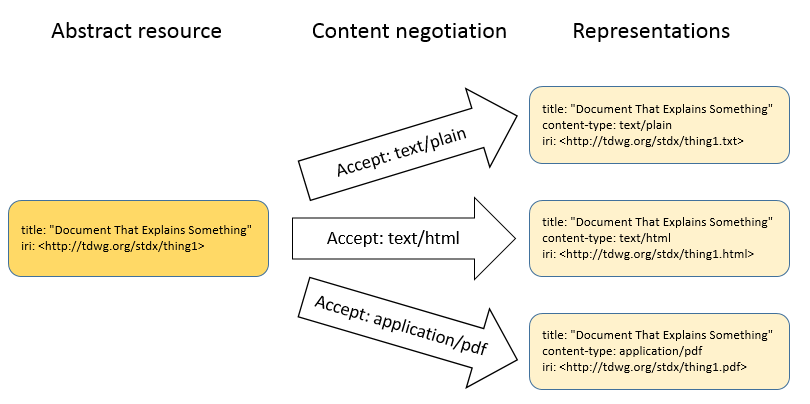
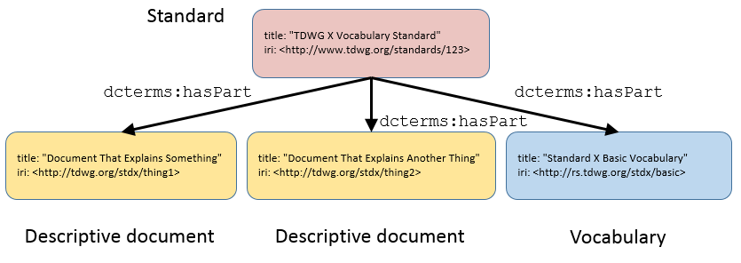
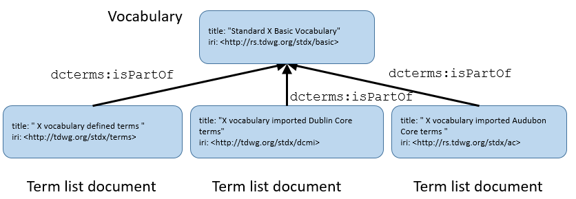
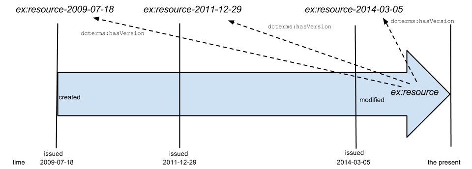

# TDWG Standards Documentation Specification #

This document is an early draft and should be considered neither stable nor citable.

**Title:** TDWG Standards Documentation Specification

**Date Issued:**

**Date Modified:**

**Contributors:** Steve Baskauf (TDWG Vocabulary Maintenance Specification Task Group), Roger Hyam (TDWG Infrastructure Project)

**Creator:** TDWG Vocabulary Maintenance Specification Task Group

**Abstract:** This document defines how TDWG standards should be presented.  It provides details about the hierarchical structure of standards and versioning of standards components.  It specifies how the properties of standards and their components should be described in human-readable and machine-readable terms.

**Legal:** This document is governed by the standard legal, copyright, licensing provisions and disclaimers issued by Biodiversity Information Standards (TDWG).

**Part of TDWG Standard:**

### Table of Contents ###

[generate when complete]

## **1 Introduction** ##

Standards adopted by Biodiversity Information Standards (TDWG) may include a number of components that are expressed in human- and machine-readable documents. It is important that users of a standard be able to locate all of these components. Users should be able to easily determine which parts of the standard are definitive (normative) and which are informative (non-normative). It should also be apparent which components are current and which are maintained for historical reasons or to support legacy applications. Machine-readable documents should be linked and described consistently to facilitate automated discovery and processing. This standard specifies how documents should be presented to achieve these requirements.

### **1.1 Definitions** ###

**resource** - Any kind of thing that can be identified. Resources can include documents, people, physical objects, and abstract concepts [RDF-PRIMER].

**document** - In this context, a document is a unit of information that can be stored or retrieved electronically as a single file.

**representation** - a view of a resource at a particular time. Representations can differ in language or format. [HTTP-1.1]

**IRI** - Internationalized Resource Identifier. A superset of Uniform Resource Identifier (URI) that uniquely identifies a resource using characters from any character set. [IRI]

**HTTP IRI** - A subset of IRIs that enable retrieval of a representation using Hypertext Transfer Protocol (HTTP).  HTTP IRIs begin with "http://".

**dereference** - to use an IRI to obtain a representation of a resource through an Internet protocol such as HTTP

**content negotiation** - a mechanism by which a client and server determine the best representation to send to the client based on the client's expressed preferences [HTTP-1.1]

**current resource** - a resource as it exists in its current state.  The current state reflects the most recent version of the resource.

**version** - a “snapshot” of a resource in time.  A version is created at a particular moment in time and documents the state of the resource until that version is replaced by a later version.  

**normative** - the prescriptive part of a standard that specifies that which is necessary to comply with the standard

**non-normative** - an informative part of a standard that provides supplemental information such as history, examples, and additional explanation beyond the information necessary to comply with the standard.

**vocabulary** - a collection of standardized terms and their definitions.  Terms may represent classes, properties, or concepts.

**metadata scheme** - a vocabulary used to make assertions about individuals (sensu OWL). Terms (or "elements") in the scheme may represent classes or properties. Axioms may describe term properties to form an ontology. [NISO] [ISO-25964-2]

**controlled vocabulary** - prescribed list of terms, each representing a concept. Controlled vocabularies are designed for applications in which it is useful to identify each concept with one consistent label. Metadata properties can interact with controlled vocabularies when the value of a property is constrained to be a term from a controlled vocabulary. [ISO-25964-2]

**distribution** - a specific available form of a dataset.  In the context of this standard, distributions are available forms of vocabulary term lists, such as downloadable files in RDF/XML or RDF/Turtle. [DCAT]

### **1.2 Namespaces** ###

 In the text and examples, IRIs are frequently abbreviated using namespace abbreviations.  The abbreviations used in this document are shown in the following table.

| **Prefix**   | **Namespace**                               |
|--------------|---------------------------------------------|
| rdf          | http://www.w3.org/1999/02/22-rdf-syntax-ns# |
| rdfs         | http://www.w3.org/2000/01/rdf-schema#       |
| dc           | http://purl.org/dc/elements/1.1/            |
| dcterms      | http://purl.org/dc/terms/                   |
| dwc          | http://rs.tdwg.org/dwc/terms/               |
| dwciri       | http://rs.tdwg.org/dwc/iri/                 |
| dwcattributes| http://rs.tdwg.org/dwc/terms/attributes/    |
| skos         | http://www.w3.org/2004/02/skos/core#        |
| vann         | http://purl.org/vocab/vann/                 |
| dcat         | http://www.w3.org/ns/dcat#                  |
| owl          | http://www.w3.org/2002/07/owl#              |
| xmpRights    | http://ns.adobe.com/xap/1.0/rights/         |

### **1.3 About the examples in this document** ###

RDF examples in this document are included to clarify the normative text, although they are not themselves normative.  In some cases, IRIs represent actual standards, documents, or terms, but in many cases they are fictitious.  Additionally, in cases where the IRIs represent real resources, the properties and values shown in the examples may not represent real metadata about those resources.  The triples included in the examples do not represent a complete graph containing all of the triples necessary to comply with this standard.  Rather, they show triples that illustrate the relationships described in the sections that precede the example.  

RDF/Turtle is used in all of the examples because it is generally the easiest RDF serialization for humans to comprehend.  Use of Turtle does not imply that it is a preferred serialization for representing the metadata and relationships among resources in machine-readable form.  Other serializations such as RDF/XML, RDFa, and JSON-LD might also be used to represent the same information.  Best-practices with respect to serialization should be established by community consensus in an effort outside of this standard.

## **2 The structure of TDWG standards** ##

If a standard were composed of a single, human-readable document, then identifying and retrieving that document via the Internet would be relatively simple.  But TDWG standards may be composed of multiple documents that may change over time and that may be delivered in a variety of formats.  This section describes the structure of TDWG standards and the relationships among the structured components of a standard.



Fig. 1. An abstract resource and its representations.

### **2.1 Abstract resources and representations** ###

A TDWG standard may be composed of several types of components.  For example, the standard may contain an explanatory document that describes how the standard should be applied in certain circumstances.  A standard may also include a vocabulary description that defines the terms included in that vocabulary.  We can consider each of these particular resources as an abstract entity that manifests itself in one or more than concrete representations.  For example, a document may exist in PDF format or as an HTML web page (Fig. 1), or a document may exist as translations in several languages.  

**2.1.1 IRIs**

Particular resources are assigned globally unique identifiers (GUIDs) to distinguish them from all other resources.  TDWG identifies resources using HTTP IRIs, a type of GUID which makes it possible to retrieve a representation of a resource using HTTP (hypertext transfer protocol).  

Both the abstract resource and specific representations of that resource are identified with HTTP IRIs.  

The IRI for abstract resources should be generic.  That is, the abstract resource IRI should not specify a file extension nor should it be structured in a way that is dependent on a particular technology or query format [COOL-URIS].  In contrast, IRIs of particular resource representations may use an IRI structure or file extension that is useful for retrieving a copy of that resource. The IRIs of abstract resources should be stable, allowing them to be used in citations of the resource.

**2.1.2 Content negotiation**

A resource will normally be permanently identified by its abstract resource IRI.  When client that attempts to retrieve a representation of that resource by dereferencing its abstract IRI, it should be redirected through content negotiation to a URL that can be used to retrieve a representation of the content type or language requested by the client (Fig. 1).  A resource may be available as several content types, but all resources should be retrievable in a human-readable form when content-type text/html is requested.  It is also best practice to make a machine-readable representation available.  If the resource is a document that is primarily intended for human consumption, then the machine-readable representation should at a minimum contain descriptive metadata about the document. In some cases (such as vocabularies), the machine-readable representation of the resource will contain a complete description of the resource.  Although there are a number of possible machine-readable formats, by default each resource should be described using RDF in a serialization recommended by the TDWG Technical Architecture Group (TAG).



Fig. 2. A standard and its components.

### **2.2 Standards components hierarchy** ###

TDWG standards consist of several IRI-identified components.  This section describes these components and how they are related to each other.

**2.2.1 Standards landing page**

Each TDWG standard will be identified by an HTTP IRI (formerly known as the "permanent URL" of the standard) that represents the standard as an abstract entity.  When the standard's IRI is dereferenced by a client requesting content-type text/html (e.g. a Web browser), that IRI should redirect to a human-readable landing webpage that describes the status of the standard, contains an abstract of the standard, and which contains hyperlinks to the various components that comprise the standard.  When the standard's IRI is dereferenced by a client requesting RDF, the client should be redirected to a document that contains machine-readable RDF metadata about the standard.  That document should link the components of the standard to the standard using the property dcterms:isPartOf (Fig. 2) as described in Section 4.2.

**2.2.2 Descriptive documents**

Each TDWG standard will have at least one human-readable document that describes the purpose of the standard and which contains information about how the standard is to be used.  This document should follow the formatting guidelines of Section 3.  When the IRI of the descriptive document is dereferenced by machine clients, the client should retrieve an RDF description of the document's metadata.  



Fig. 3. Relationship of a vocabulary to its component term list documents.

**2.2.3 Vocabulary documents**

TDWG vocabularies will be associated with an HTTP IRI that represents the vocabulary itself.  The vocabulary is distinct from the standard, since the vocabulary is just one part of the standard.  For this reason, the vocabulary IRI will not be the same as the IRI that identifies the standard.  When the vocabulary IRI is dereferenced by a client requesting content-type text/html, the client should obtain a web page that links to term list documents (Fig. 3).  Each term list document corresponds to a namespace that contains a set of terms.  There will be at least one document that lists and describes terms defined in a namespace controlled by TDWG.  The human-readable representation of this document will contain the normative definition of each term.  The machine-readable representation of this document will contain the minimal RDF metadata described in section 3.3.  There may also be documents that list terms in namespaces outside of the standard or terms that are not defined by TDWG.  Human-readable representations of these documents will contain links to the websites that define those terms.  Machine-readable representations of these documents will use the property dcterms:isPartOf to link to the machine-readable definitions of the external terms if those definitions exist.  



Fig. 4. Relationship of a resource to its versions over time.

### **2.3 Versioning model** ###

Resources associated with TDWG standards may change over time.  TDWG uses a versioning model that relates the current resource and versions of the resource that have changed over time.  The purpose of the versioning model is to enable a user to start with the current resource or any version of the resource and trace the changes that have occurred to that resource over time.

**2.3.1 Current resources**

Each resource (document, vocabulary, term, etc.) exists in a current state.  That current state reflects the most recent version of that resource.  The current resource is identified by an IRI that does not change over time.  The current resource IRI can be used by humans or machines to retrieve a representation of the resource as it exists at the present time.  Because the current resource IRI does not change, it is stable and should be the IRI that is cited and is linked to whenever one wishes to refer to the resource in general.  

**2.3.2 Versions**

Each resource also exists as versions that document “snapshots” of the resource over time (Fig. 4).  A version is issued at a particular moment in time and documents the state of the resource until the version is replaced by a later version.  Each version of a resource is identified by an IRI that is distinct from the IRI of the current resource and from all other versions of that resource.  Typically, the IRI of a version is formed by appending the ISO 8601 creation date of the resource to the IRI if the abstract resource.  

A current resource is related to one of its versions by the property dcterms:hasVersion.  A version is related to its current resource by the property dcterms:isVersionOf, to a version that it supersedes by dcterms:replaces, and to a version that supersedes it by dcterms:isReplacedBy.  The metadata for a current resource should specify the IRI of the current resource, the IRI of the most recent version, and the IRI of any previous version that was superseded.  Metadata of a past version should specify that version's IRI, specify the IRI of the current resource, and link to any previous or subsequent versions.  

The versioning model is specific to neither humans nor machines, and either should be able to use the resource IRIs and properties to traverse the links from one version to another.  


## **3 Human-readable documents** ##

In order for a standard to achieve its purpose, it must include documents that permit human users to understand what is necessary to comply with the requirements of the standard.  This section describes how human-readable documents should be constructed to make this possible.

Determining what is necessary to comply with a standard is necessarily a human activity.  Therefore, the normative content of the standard should be contained exclusively in human-readable documents.

### **3.1 Landing page for the standard** ###

When the HTTP IRI of a standard is dereferenced by a client requesting text/html (for example, when a human uses a Web browser), the client should receive a human-readable document that describes basic information about the standard as described in the subparts of this section.  

**3.1.1 Name of the standard**

The full name must be in English and
must be unique within the scope of TDWG standards, but otherwise is not
controlled and may contain any combination of characters.

**3.1.2 IRI of the standard**

The landing page should include the HTTP IRI that identifies the standard.  The text of the landing page should indicate that this is the IRI that should be cited and to which hyperlinks should be made.  This is important because content negotiation may redirect users to some other IRI that is specific to the delivery mechanism and which might be subject to change at some time in the future.

**3.1.4 Link to TDWG**

The landing page should make it clear that this is a TDWG standard and should provide a link to the TDWG home page.  

**3.1.5 Abstract**

An abstract should provide a brief description of the purpose of the standard.

**3.1.6 Preferred citation**

The landing page should indicate a preferred citation for the standard that includes at least the name of the standard and the IRI. The exact format and content of the citation is not specified by this standard.

**3.1.7 Links to parts of the standard**

Each part of the standard should be listed, with a hyperlink that leads to that part (Section 2.2).  The parts must include at least one descriptive document, whose form is described in section 3.2.

### **3.2 Descriptive documents** ###

A standard has one or more descriptive documents that describe the purpose of the standard and which contain information about how the standard is to be used. The choice of whether to place all of this material in a single document or to separate it into several documents should be made based on what will make the standard the most easy to understand and use.  

**3.2.1 Normative and non-normative sections of descriptive documents**

The normative and non-normative parts of standards should be clearly labeled as such.  If all of the content of a document is normative, this should be stated in the introduction to the document.  If a single document contains both normative and non-normative content, material in a single section should be of a single type.  The introduction should state that content is normative unless otherwise noted and headings should indicate if material in that section is non-normative.

It is also permissible to indicate in the introduction that content of a particular type (e.g. examples or diagrams) is non-normative.

**3.2.2 Versioning**

Descriptive documents are resources that follow the versioning model described in Section 2.3.  Thus each particular document version will represent the state of the generic document from the time it was issued until the time that version was superseded by a later version.  Thus, the date issued that is stated on a particular document version will reflect the date that particular version was issued (dcterms:issued).  Date created (dcterms:created) should be reserved to indicate the date that the first version of the document was issued.

**3.2.3 Layout and style**

Descriptive documents should be divided into three main sections:

-   A header section
-   Table of contents
-   A body section
-   A footer section

**3.2.3.1 Header Section**

The header section must contain the following parts:

**Title:** The title of the document.

**Date Issued:** The date of publication of this version in ISO 8601 Date format.

**Part of TDWG Standard:** The IRI of the standard of which this document is part. The IRI should dereference to the standard's landing page.

**Latest version IRI:** The current resource IRI that will always return the latest version of the document.

**Previous version:** The IRI of the previous version (if any). [should this be "Supersedes"?]

**Replaced by:** The IRI of the next version (if any).  [should this be "Superseded by"?]

**Abstract:** A single paragraph summary of the document.

**Contributors:** A list of the people who are responsible for the
document's creation. The first person in the list should be the
principal contact.

Contributors’ names must be quoted in the following format: "FirstName
Initials LastName (Affiliation)" where:

Either one or both of FirstName and Initials must be present.

Affiliation is the organization or group the contributor is working with in relation to this document and is OPTIONAL.

Examples:

-   Roger D. Hyam (TDWG)
-   Roger Hyam (TDWG Infrastructure Project)
-   R. Hyam

**Creator:** The Task Group that created the document.

**Document Status:** One of the status categories listed at [http://www.tdwg.org/standards/status-and-categories/](http://www.tdwg.org/standards/status-and-categories/).

**3.2.3.2 Table of Contents Section**

The table of contents section should contain an ordered list of all the headings (along with their numbers) that occur in the body section and nothing else. The items in the list should be hypertext links to the headings in the body. [Do we really need to specify the details of this??? Currently DwC and AC use whatever capabilities are built into the delivery system (e.g. sidebars) to enable hyperlinking to sections.]

**3.2.3.3 Body Section**

[TODO: do we need to specify some features of existing standards documents, such as "Introduction", "Motivation", "Rationale", or do we leave this up to the authors?]

The body text should be divided by a hierarchy of subheadings. The subheadings must be numbered consecutively using simple decimal system.
The final number must not be followed by a decimal point. An example:

1 First Main Section

1.1 First subsection within first main section.

1.12.5 The fifth sub-subsection within the twelfth subsection of the first section.

2 Second Main Section

**3.2.3.4 Footer section**

The footer should contain a copyright statement and licensing information.  Typically, the copyright is held by Biodiversity Information Standards (TDWG) and the license is [Creative Commons Attribution](http://creativecommons.org/licenses/by/4.0/) (CC BY).

[This used to say: "A reference or link to a document containing the Copyright, Licensing and Disclaimer statements that govern this document. This will usually be the standard one supplied by TDWG."  This has been included in some standards documents, but not consistently.]

**3.2.4 Language**

All normative content must be in English. ~~Translations of normative documents may be included in the standard but the translations must be treated as informative documents.~~ [This was copied from the earlier specification.  Do we really want to say that translations may be "included in the standard"?  That would imply that creating additional translations would require amending the standard.  Is that what we really want???] Translations of normative documents are encouraged but will be treated as ancillary documents that are not included in the standard.

**3.3 Archiving of documents**

In order for a standard to enable compliance with a consensus community practice, a version of a standards document must be immutable and easily viewable by the public. This has several implications for the way in which documents are archived.

In order to ensure the stability of a human-readable document, it should be archived as a discrete file as opposed to being generated from a potentially changing database.  The archived document file must be in an open format for which parsers are commonly available. For this purpose an open format is defined as being one for which it would be possible to write a parser on the basis of a published specification without having to rely on code libraries for which the source code is not available or to pay a license fee.

In accordance with Section 2.1, the document may exist as files in a variety of formats that can be retrieved through content negotiation.  For example, a document may be available in any of HTML, PDF, and MarkDown formats.  However, when rendered by a parser, each differently formatted file must render to a form that is substantively the same to a human reader.  At least one available form must be easily viewable to a human reader in a browser that requests text/html, regardless of whether the source file is actually in HTML format.

Documents should be maintained as part of a publicly accessible version control system that ensures document files will not be lost and that previous document versions can be located and accessed through their immutable IRIs.  

### **3.3 Vocabulary descriptions** ###

Documents that describe vocabularies make up a special category of human-readable descriptive documents.  As such, vocabulary descriptions will comply with the requirements of Section 3.2.  However, they will also have particular characteristics as described in the following sections.

**3.3.1 Landing page for the vocabulary**

Although a standard may define a vocabulary, the standard may also include other documents such as guides that describe how the vocabulary may be used in different contexts.  It is also possible for a standard to define several vocabularies that may share subsets of terms defined by the vocabulary.  Thus it is clear that a vocabulary is an entity that is distinct from the standard that defines it.  As such, the vocabulary will have an IRI that is distinct from the standard's IRI.  The vocabulary's landing page is the page that is presented to a human user when the vocabulary IRI is dereferenced and content-type text/html is requested.

In its header, the landing page will contain the metadata described in Section 3.2.3.1, with the release date serving as the Date Issued, and the vocabulary IRI serving as the Latest Version IRI.

As with other descriptive documents, the body of the landing page should contain an explanation of the purpose of the vocabulary.  However, it must also contain links to the term lists that indicate the terms that make up the vocabulary (Section 3.3.3).  

**3.3.2 Terms as versioned resources**

A term is a resource that persists over time (Fig. 4) and that complies with Section 2.3 of this standard. The current state of the term is represented by the term IRI, which does not change and which can be dereferenced to discover the current term definition.  

The state of the term at particular times is recorded via versions of the term.  A new version of the term is issued on a particular date and the term version IRI should be dereferenceable to discover the definition of the term version when it was issued.  

**3.3.3 Term lists**

A term list is a series of term entries that can be easily read and understood by humans.  Each vocabulary will have at least one term list that contains terms that are defined by the standard that contains it.  Vocabularies may also have term lists that contain terms that are borrowed from other vocabularies that define those terms.  For lists of terms that are defined by the standard, the term list is identified by the IRI of the namespace used by the terms on that list.  For lists of terms borrowed from other vocabularies, any IRI may be used.  It is permissible for the borrowed terms to be included in the same list as the terms defined by the standard.   

Term lists of terms defined by TDWG must include the following items:

**Namespace URI** - the IRI that identifies the term list. [Do we specify that term URIs should follow the slash URI pattern?  In that case the term list URI would be the same as the namespace vs. a possible discrepancy caused by the trailing # on hash URIs - namespace with, vocabulary IRI without??? see https://www.w3.org/TR/swbp-vocab-pub/#naming; SKOS example]

**Preferred namespace abbreviation** - the preferred abbreviation for the term list namespace.

Each term entry should include the following items.

**Term name** (required) - The term name is a controlled value that represents the class, property, or concept described by the term definition.  The term name is composed of the local name part of the term IRI, with a prepended namespace abbreviation (QName) that is defined in the introduction to the vocabulary list. [RECIPES] The term name is often related to the meaning of the term, but users must not attempt to understand the meaning of the term by interpreting its name.  Rather, the term definition should be consulted.    [Should it be required that the QName be included for terms defined by the standard? AC does, DwC doesn't.]

**Label** (optional? DwC doesn't list it in the human-readable representation) - The label is a word or short phrase that serves as a human-readable name for the term.

**Value** (required for controlled vocabularies, not applicable to metadata schemes) - A string that is unique within a controlled vocabulary that identifies the concept in the context of a text-based metadata transfer system.  The value should consist of [unicode characters?].

**Term IRI** (required) - The HTTP IRI that uniquely identifies the current term

**Term version IRI** (required if defined by the containing vocabulary) - The HTTP IRI that identifies the version of the term that is currently in force.

**Modified** (required if defined by the containing vocabulary) - The date in ISO 8601 Date format on which the most recent version of the term was issued.

**Definition** (required) - The normative definition of the term, written in English.  The definition should include precisely the wording required to describe the class, property, or concept.  Additional informative content should be presented in comments or notes.

**Type** (required) - Values include "Class", "Property", and "Concept".

The term list may contain other properties of the term that are deemed to be useful, including informative comments or notes that provide examples or clarification, but which do not form part of the normative definition of the term.

**3.3.4 Term version lists**

A term version list provides a historical record of all versions of terms that are defined as part of a standard.  It is similar to the term list described in section 3.3.3, except that the entries on the list are versions of terms rather than current terms.  

The term version list should be identified by an IRI that facilitates discovery of the term versions that it lists when the term version IRIs are dereferenced.  

Each term version entry must include the following items.

**Term name** - The term name will be the same as the name used for the current term when the version was valid [or recommended, or non-superseded???].  Because there may be several versions of the term on the list, the term name will not necessarily be unique on the list.  

**Term version IRI** - The HTTP IRI that identifies the particular version of the term.

**Version of** - The HTTP IRI that uniquely identifies the current term associated with the version.

**Issued** - The date in ISO 8601 Date format on which the version was issued.

**Definition** - The normative definition of the term as it stood in that version.

**Replaces** - The IRI of the previous version (if any) that the subject version replaces.  

**Is replaced by** - The IRI of the subsequent version (if any) that replaces the subject version.

The term list may contain other properties of the term that are deemed to be useful.

## **4 Machine-readable documents** ##

It is desirable for user agents (machines) to be able to discover and process metadata associated with standards documents and vocabularies without human intervention. This section describes how machine-readable documents should be constructed to make this possible.

The relationships described in this section may be expressed as Resource Description Framework (RDF) but that is not to the exclusion of other methods that may be available for expressing relationships in a manner that facilitates machine processing.

### **4.1 Identifying a resource and the machine-readable document that describes it** ###

In the description of any resource, it is important to distinguish between the identifier for the resource and the identifier for the machine-readable document that describes it.  When describing a resource, the resource IRI should be the subject of statements about the current resource.  The machine-readable document that describes it must have a different IRI.  The resource should be linked to the document that describes it by the property dcterms:isReferencedBy, while the machine-readable document should be linked to the resource it describes by the property dcterms:references.

When a client dereferences the resource IRI, it is desirable that content negotiation result in return of a machine-readable document that describes the resource in the format requested in the request header.

**4.1.1 Example of linking a resource to the machine-readable document that describes it (non-normative)**

The following example is expressed in RDF/Turtle:

```
<http://rs.tdwg.org/dwc/terms/guides/text>
     dcterms:title "Darwin Core Text Guide";
     dcterms:isReferencedBy <https://github.com/tdwg/dwc/blob/master/terms/guides/text/index.ttl>.

<https://github.com/tdwg/dwc/blob/master/terms/guides/text/index.ttl>
     dcterms:references <http://rs.tdwg.org/dwc/terms/guides/text>;
     dc:format "text/turtle".
```

When the resource IRI http://rs.tdwg.org/dwc/terms/guides/text is dereferenced requesting media type text/turtle, the server should redirect to the document https://github.com/tdwg/dwc/blob/master/terms/guides/text/index.ttl which contains the RDF description of the Darwin Core Text Guide in Turtle serialization.

### **4.1.2 Types of resources** ###

Indicate the class of a resource using rdf:type.  The following classes should be used:

|**Class**                          | **Machine-readable value**|
|-----------------------------------|---------------------------|
| Standard                          | dcterms:Standard          |
| Vocabulary                        | dcterms:Dataset           |
| Term List                         | dcat:Dataset *            |
| Property                          | rdf:Property              |
| Class                             | rdfs:Class                |
| Term from a controlled vocabulary | skos:Concept              |         

* The semantics of the DCAT Recommendation entail that an instance of dcat:Dataset is also an instance of dcterms:Dataset.

Documents should be typed according to a well-known vocabulary.  Suggestions of appropriate classes can be fount in an ancillary document related to this standard. [put this here since I don't know the future of FOAF, schema.org, bibo, etc.]

### **4.2 General metadata** ###

The same metadata that is presented in the header section of the human-readable representations of descriptive documents and vocabulary landing pages (Section 3.2.3.1) should be provided in corresponding machine-readable documents.  The following properties with appropriate values should be used to describe the document or vocabulary:

|**Human-readable label** | **Machine-readable property** | **Type of value** |
|-------------------------|-------------------------------|-------------------|
| Title                   | dcterms:title, rdfs:label *   | literal           |
| Part of TDWG Standard   | dcterms:isPartOf              | IRI that denotes the containing standard; omit for the standard itself|
| Contributors            | dc:contributor                | literal; repeat property for each contributor's name; omit for the stadard itself since the contributors of each part will be listed |
| Creator                 | dc:creator                    | literal providing the name of the Task Group responsible for creating the document |
| License                 | dcterms:license               | IRI for a license; use CC BY for descriptive documents and CC0 for vocabularies |
| Legal                   | xmpRights:UsageTerms          | literal containing this text "This document is governed by the standard legal, copyright, licensing provisions and disclaimers issued by Biodiversity Information Standards (TDWG)."|
| Abstract                | dcterms:description           | literal containing the human-readable abstract of the document minus any references or hyperlinks |

* Both of these terms are well-known properties used to indicate a human-readable label for a resource.  Including both increases the likelihood that a consuming application will be able to present that label to human users.

The property dcterms:contributor should be used to link the document or vocabulary to an IRI that denotes the contributor.

[How do we decide the level at which comtributors are acknowledged? For something like best-practice guides, it's clear.  But what about vocabularies and term lists?  Also, does TDWG have a policy that vocabularies (as opposed to descriptive documents) should be licensed CC0?  If not, it should!]

**4.2.1 Example of expressing general metadata (non-normative)**

```
<http://rs.tdwg.org/dwc/terms/guides/text>
     dcterms:title "Darwin Core Text Guide"@en;
     rdf:label "Darwin Core Text Guide"@en;
     dcterms:isPartOf <http://www.tdwg.org/standards/450/>;
     dc:contributor "Tim Robertson (GBIF)",
                    "John Wieczorek (MVZ)",
                    "Markus Döring (GBIF)",
                    "Renato De Giovanni (CRIA)",
                    "Dave Vieglais (KUNHM)";
     dcterms:contributor <http://orcid.org/0000-0001-6215-3617>,
                         <http://orcid.org/0000-0001-7757-1889>,
                         <http://orcid.org/0000-0002-6513-4996>;
     dc:creator "TDWG Darwin Core Task Group";
     dcterms:license <http://creativecommons.org/licenses/by/4.0/>;
     xmpRights:UsageTerms "This document is governed by the standard legal, copyright, licensing provisions and disclaimers issued by Biodiversity Information Standards (TDWG).";
     dcterms:description "Guidelines for implementing Darwin Core in Text files.".
```

### **4.3 Metadata describing and linking versions** ###

The property owl:versionInfo, which is expected to have a literal value, should be used to provide information about the version of a resource.  This standard does not specify a particular version identifying system; however, it should be understood that version information is intended for a human audience.  Therefore, a system should be used that makes it apparent to a human that a certain version precedes or follows another version.

A current resource is related to its versions by dcterms:hasVersion, while a version is related to its current resource by dcterms:hasVersion.  A version is related to a previous version by dcterms:replaces, while a version is related to a subsequent version by dcterms:isReplacedBy.

The property dcterms:issued should be used to indicate the date on which a version was published.  The property dcterms:created should be used to indicate the date that the first version of a resource was issued.  The property dcterms:modified should be used to indicate the date that the most recent version was issued.

**4.3.1 Example of linking a current resource to its versions (non-normative)**

The following example is expressed in RDF/Turtle:

```
<http://rs.tdwg.org/dwc/terms/guides/text>
     dcterms:title "Darwin Core Text Guide"@en;
     rdfs:label "Darwin Core Text Guide"@en;
     dcterms:created "2009-12-07"^^xsd:date;
     dcterms:modified "2014-11-08"^^xsd:date;
     dcterms:hasVersion <http://rs.tdwg.org/dwc/2014-11-08/terms/guides/text>;
     dcterms:hasVersion <http://rs.tdwg.org/dwc/2009-12-07/terms/guides/text>.

<http://rs.tdwg.org/dwc/2014-11-08/terms/guides/text>
     dcterms:title "Darwin Core Text Guide (2014-11-08 release)"@en;
     rdfs:label "Darwin Core Text Guide (2014-11-08 release)"@en;
     owl:versionInfo "2014-11-08";
     dcterms:isVersionOf <http://rs.tdwg.org/dwc/terms/guides/text>;
     dcterms:issued "2014-11-08"^^xsd:date;
     dcterms:replaces <http://rs.tdwg.org/dwc/2009-12-07/terms/guides/text>.

<http://rs.tdwg.org/dwc/2009-12-07/terms/guides/text>
     dcterms:title "Darwin Core Text Guide (2009-12-07 release)"@en;
     rdfs:label "Darwin Core Text Guide (2009-12-07 release)"@en;
     owl:versionInfo "2009-12-07";
     dcterms:isVersionOf <http://rs.tdwg.org/dwc/terms/guides/text>
     dcterms:issued "2009-12-07"^^xsd:date;
     dcterms:isReplacedBy <http://rs.tdwg.org/dwc/2014-11-08/terms/guides/text>.
```

See also the example in section 4.5.3, which illustrates versioning of terms.

### **4.4 Vocabularies, term lists, and terms** ###

A vocabulary is a resource that may form part of a standard.  A vocabulary is described by the general metadata specified in section 4.2.  A vocabulary also includes lists of terms that the vocabulary contains.  Term lists are also described by metadata specified in section 4.2 as well as additional properties described in section 4.4.2.  Terms, term lists, and vocabularies have hierarchical relationships that are expressed using the property dcterms:isPartOf:

```
<term> dcterms:isPartOf <termList>.
<termList> dcterms:isPartOf <vocabulary>.
```

**4.4.1 Relationships between vocabularies and term lists**

Vocabularies consist of at least one term list (section 2.2.3).  In a case where it is likely that a vocabulary will never include terms beyond those defined by that vocabulary, it may be convenient to construct IRIs for the vocabulary and term list that will dereference to the same document.  For example, the vocabulary IRI might be http://rs.tdwg.org/ex, with the term list IRI http://rs.tdwg.org/ex/, or the vocabulary IRI might be http://rs.tdwg.org/ex/#vocab, with the term list IRI http://rs.tdwg.org/ex/.  With suitable server settings, these pairs of IRIs could dereference to the same representation.  This approach is not recommended when a vocabulary consists of, or is likely in the future to consist of terms from multiple namespaces.  In every case, in the interest of consistency with the hierarchy model, the term list IRI and the vocabulary IRI should be distinct and linked by dcterms:isPartOf.

**4.4.1.1 Example of relationships between vocabularies and term lists (non-normative)**

The following example is expressed in RDF/Turtle:

```
<http://rs.tdwg.org/dwc/basic>
     dcterms:title "Darwin Core Basic Vocabulary"@en;
     rdfs:label "Darwin Core Basic Vocabulary"@en;
     dcterms:isPartOf <http://www.tdwg.org/standards/450/>;
     a dcterms:Dataset.

<http://rs.tdwg.org/dwc/enhanced-vocabulary>
     dcterms:title "Darwin Core Semantically Enhanced Vocabulary"@en;
     rdfs:label "Darwin Core Semantically Enhanced Vocabulary"@en;
     dcterms:isPartOf <http://www.tdwg.org/standards/450/>;
     a dcterms:Dataset.

<http://rs.tdwg.org/dwc/terms/>
     dcterms:title "Core terms defined by Darwin Core"@en;
     rdfs:label "Core terms defined by Darwin Core"@en;
     dcterms:isPartOf <http://rs.tdwg.org/dwc/basic>;
     dcterms:isPartOf <http://rs.tdwg.org/dwc/enhanced-vocabulary>;
     dcterms:modified "2014-11-08"^^xsd:date;
     a dcat:Dataset.

<http://rs.tdwg.org/dwc/dwcattributes/>
     dcterms:title "Attributes defined by Darwin Core"@en;
     rdfs:label "Attributes defined by Darwin Core"@en;
     dcterms:isPartOf <http://rs.tdwg.org/dwc/basic>;
     dcterms:isPartOf <http://rs.tdwg.org/dwc/enhanced-vocabulary>;
     dcterms:modified "2009-12-07"^^xsd:date;
     a dcat:Dataset.

<http://rs.tdwg.org/dwc/dcmi-terms>
     dcterms:title "Dublin Core terms borrowed by Darwin Core"@en;
     rdfs:label "Dublin Core terms borrowed by Darwin Core"@en;
     dcterms:isPartOf <http://rs.tdwg.org/dwc/basic>;
     dcterms:isPartOf <http://rs.tdwg.org/dwc/enhanced-vocabulary>;
     dcterms:modified "2009-12-07"^^xsd:date;
     a dcat:Dataset.

<http://rs.tdwg.org/dwc/semantics/>
     dcterms:title "Darwin Core Semantic Relationships"@en;
     rdfs:label "Darwin Core Semantic Relationships"@en;
     dcterms:isPartOf <http://rs.tdwg.org/dwc/enhanced-vocabulary>;
     dcterms:modified "2015-03-19"^^xsd:date;
     a dcat:Dataset.
```

**4.4.2 Metadata terms describing term lists**

Each set of terms defined by a TDWG standard that share a namespace will be included in a term list that corresponds to that namespace.  Thus, when the IRI of a term that is defined by the standard is dereferenced with a request for machine-readable metadata, a document may be returned through content negotiation that contains the metadata for those terms.  Other terms that are borrowed from other vocabularies will be grouped in one or more term lists.  

All terms are related to the term list that contains them by the property dcterms:isPartOf.    

Each term list containing terms defined by a particular standard will be the defining authority for those terms.  The special relationship between a term and the term list that defines it is indicated by rdfs:isDefinedBy.  Authoritative term lists should provide guidance to user about how namespaces should be abbreviated by using the following terms:

| **Human-readable label**    | **Machine-readable literal-value property**|
|-----------------------------|--------------------------------------------|
| Preferred namespace prefix  | vann:preferredNamespacePrefix              |
| Namespace IRI               | vann:preferredNamespaceUri                 |

When a preferred namespace prefix is chosen, care should be taken to ensure that there is no collision with other commonly used prefix abbreviations. The namespace IRI will often be the same as the IRI that identifies the term list, although this is not always the case, particularly when hash URIs are used.  For example, the SKOS ontology is identified by http://www.w3.org/2004/02/skos/core, but the SKOS namespace (usually abbreviated skos:) is http://www.w3.org/2004/02/skos/core#.

Term lists for borrowed terms are simply used to group those terms and are not authoritative.  So information about preferred namespace abbreviations and IRIs should not be included in the metadata about that term list.  However, if the defining authority for terms within a namespace fails to provide that information, it can be asserted within the document that contains the metadata about the term list.  

**4.4.2.1 Examples (non-normative)**

An example of metadata about an authoritative term list:

```
<http://rs.tdwg.org/ac/>  # *** made up IRI ***
     dcterms:title "Basic Audubon Core Vocabulary"@en;
     rdfs:label "Basic Audubon Core Vocabulary"@en;
     a dcterms:Dataset.

<http://rs.tdwg.org/ac/terms/>
     dcterms:title "Audubon Core Term List"@en;
     rdfs:label "Audubon Core Term List"@en;
     vann:preferredNamespacePrefix "ac";
     vann:preferredNamespaceUri "http://rs.tdwg.org/ac/terms/";
     dcterms:isPartOf <http://rs.tdwg.org/ac/>;
     a dcat:Dataset.
<http://rs.tdwg.org/ac/terms/subtype>
     rdfs:label "Subtype";
     rdfs:isDefinedBy <http://rs.tdwg.org/ac/terms/>;
     dcterms:isPartOf <http://rs.tdwg.org/ac/terms/>;
     a rdf:Property.
<http://rs.tdwg.org/ac/terms/caption>
     rdfs:label "Caption";
     rdfs:isDefinedBy <http://rs.tdwg.org/ac/terms/>;
     dcterms:isPartOf <http://rs.tdwg.org/ac/terms/>;
     a rdf:Property.
```

An example of metadata about a non=authoritative term list:

```
<http://rs.tdwg.org/ac/borrowed/>
     dcterms:title "Audubon Core Borrowed Terms"@en;
     rdfs:label "Audubon Core Borrowed Terms"@en;
     dcterms:isPartOf <http://rs.tdwg.org/ac/>;
     a dcat:Dataset.
<http://iptc.org/std/Iptc4xmpExt/2008-02-29/WorldRegion>
     rdfs:label "World Region";
     dcterms:isPartOf <http://rs.tdwg.org/ac/borrowed/>;
     a rdf:Property.
<http://purl.org/dc/terms/format>
     rdfs:label "Format";
     dcterms:isPartOf <http://rs.tdwg.org/ac/borrowed/>;
     a rdf:Property.

# IPTC terms have URIs that are not dereferenceable, so give some information about their namespace
<http://iptc.org/std/Iptc4xmpExt/2008-02-29/>
     vann:preferredNamespacePrefix "Iptc4xmpExt";
     vann:preferredNamespaceUri "http://iptc.org/std/Iptc4xmpExt/2008-02-29/";

```

### **4.5 Metadata properties for describing vocabulary terms** ###

Because terms are resources, they are versioned and the terms used for relating current resources to versions (Section 4.3) apply to them as well.

The following properties are required for current terms and term versions in addition to the properties listed in Section 4.3 and 4.4. Note that the term or term version IRI will be present as the subject of the property

| **Human-readable label** | **Machine-readable property** | **Type of value** |
|--------------------------|-------------------------------|-------------------|
| Term name                | rdfs:label                    | Literal           |
| Definition               | rdfs:comment                  | Literal           |
| Type                     | rdf:type                      | IRI               |

Values for rdfs:label and rdfs:comment should be English language-tagged plain literals.  Values in other languages may be provided, but should be included in other ancillary documents that are associated with, but not included within the standard (see section 4.5.1).

Types should be rdf:Property for properties, rdfs:Class for classes, and skos:Concept for controlled values.

Current terms that are no longer valid should have the property owl:deprecated with a literal value of "true" datatyped as boolean.  Note that in this context, a "current" term does not necessarily mean that it is recommended or valid for use.  Rather, it means that the term IRI can be dereferenced by a client that wants to obtain information about it.

Term versions should have the property dwcattributes:status with possible values of "recommended" (for the most recent term version of a term that is currently valid), "superseded" (for term versions having more recent versions), or "deprecated" (for the most recent version of a term that is no longer valid).

The property dcterms:description may optionally be used to provide additional information that is not part of the normative definition of the term.

**4.5.1. Labels in other languages**

In addition to following the generic practice of using rdfs:label to assign a name to the term (section 4.5), it may also desirable to use the specific SKOS properties skos:prefLabel and skos:altLabel to indicate the preferred and alternative labels for vocabulary terms in other languages.  However, assignment of such labels falls outside the TDWG Standards process, so these preferred and alternate labels should be include in ancillary documents associated with, but not included within the standard itself.

**4.5.2 Metadata properties for describing controlled vocabulary terms**

Controlled vocabulary terms are instances of the class skos:Concept.  As such, it is appropriate to assign to such terms properties from the SKOS Simple Knowledge Organization System W3C Recommendation [SKOS] as necessary to define the relationships between that term and other resources.  It is not generally appropriate to use the SKOS vocabulary with vocabulary terms that are instances of the classes rdf:Property and rdfs:Class.  Since it is a general practice to assign SKOS concepts to a concept scheme, controlled vocabulary terms should be linked to that scheme by skos:inScheme.  However, the structuring of such schemes is beyond the scope of this document.

To facilitate use by applications programmed to make use of SKOS properties, it is recommended that controlled vocabulary term descriptions include a skos:definition property that has the same value as the rdfs:comment property routinely used to indicate the human-readable definition for every TDWG vocabulary term.

As with all other TDWG vocabulary terms, controlled value terms will be assigned a term IRI.  That IRI may be used as the subject or object when expressing relationships with other resources.  However, in the context of information transfer, there may be cases where it is more desirable to represent the controlled vocabulary term by means of a unique text string.  To facilitate such use, each controlled vocabulary term should be assigned a string that is unique within the controlled vocabulary.  That string should be designated by making it a plan literal value (without language tag) of an rdf:value property of the term.  

**4.5.3 Examples related to terms (non-normative)**

The following example of terms in a metadata scheme is expressed in RDF/Turtle.  Note that it follows the pattern where the term list URI would dereference to a different document than the vocabulary URI.

```
<http://rs.tdwg.org/dwc/>
     dcterms:title "Basic Darwin Core Vocabulary"@en;
     rdfs:label "Basic Darwin Core Vocabulary"@en;
     a dcterms:Dataset.

<http://rs.tdwg.org/dwc/terms/>
     dcterms:title "Core terms defined by Darwin Core"@en;
     rdfs:label "Core terms defined by Darwin Core"@en;
     vann:preferredNamespacePrefix "dwc";
     vann:preferredNamespaceUri "http://rs.tdwg.org/dwc/terms/";
     dcterms:isPartOf <http://rs.tdwg.org/dwc/>;
     a dcat:Dataset.

<http://rs.tdwg.org/dwc/terms/recordedBy>
     rdfs:label "Recorded By"@en;
     rdfs:comment "A list (concatenated and separated) of names of people, groups, or organizations responsible for recording the original Occurrence. The primary collector or observer, especially one who applies a personal identifier (recordNumber), should be listed first."@en;
     dcterms:description "The recommended best practice is to separate the values with a vertical bar (' | '). The primary collector or observer, especially one who applies a personal identifier (recordNumber), should be listed first. Examples: "José E. Crespo", "Oliver P. Pearson | Anita K. Pearson" where the value in recordNumber "OPP 7101" corresponds to the number for the specimen in the field catalog (collector number) of Oliver P. Pearson."@en;
     a rdfs:Property;
     dcterms:modified "2014-10-23"^^xsd:date;
     dcterms:hasVersion <http://rs.tdwg.org/dwc/terms/history/#recordedBy-2014-10-23>;
     dcterms:hasVersion <http://rs.tdwg.org/dwc/terms/history/#recordedBy-2009-04-24>;
     rdfs:isDefinedBy <http://rs.tdwg.org/dwc/terms/>;
     dcterms:isPartOf <http://rs.tdwg.org/dwc/terms/>.

<http://rs.tdwg.org/dwc/terms/history/>
     dcterms:title "Darwin Core Terms Complete History"@en;
     a dcat:Dataset.

<http://rs.tdwg.org/dwc/terms/history/#recordedBy-2014-10-23>
     rdfs:label "Recorded By"@en;
     rdfs:comment "A list (concatenated and separated) of names of people, groups, or organizations responsible for recording the original Occurrence. The primary collector or observer, especially one who applies a personal identifier (recordNumber), should be listed first."@en;
     dcterms:description "The recommended best practice is to separate the values with a vertical bar (' | '). The primary collector or observer, especially one who applies a personal identifier (recordNumber), should be listed first. Examples: "José E. Crespo", "Oliver P. Pearson | Anita K. Pearson" where the value in recordNumber "OPP 7101" corresponds to the number for the specimen in the field catalog (collector number) of Oliver P. Pearson."@en;
     a rdfs:Property;
     dcterms:issued "2014-10-23"^^xsd:date;
     dcterms:isVersionOf <http://rs.tdwg.org/dwc/terms/recordedBy>;
     dcterms:replaces <http://rs.tdwg.org/dwc/terms/history/#recordedBy-2009-04-24>;
     rdfs:isDefinedBy <http://rs.tdwg.org/dwc/terms/history/>;
     dcterms:isPartOf <http://rs.tdwg.org/dwc/terms/history/>.

<http://rs.tdwg.org/dwc/terms/history/#recordedBy-2009-04-24>
     rdfs:label "Recorded By"@en;
     rdfs:comment "A list (concatenated and separated) of names of people, groups, or organizations responsible for recording the original Occurrence. The primary collector or observer, especially one who applies a personal identifier (recordNumber), should be listed first."@en;
     dcterms:description "Example: "Oliver P. Pearson; Anita K. Pearson" where the value in recordNumber "OPP 7101" corresponds to the number for the specimen in the field catalog (collector number) of Oliver P. Pearson."@en;
     a rdfs:Property;
     dcterms:issued "2009-04-24"^^xsd:date;
     dcterms:isVersionOf <http://rs.tdwg.org/dwc/terms/recordedBy>;
     dcterms:isReplacedBy <http://rs.tdwg.org/dwc/terms/history/#recordedBy-2014-10-23>;
     rdfs:isDefinedBy <http://rs.tdwg.org/dwc/terms/history/>;
     dcterms:isPartOf <http://rs.tdwg.org/dwc/terms/history/>.

```

The following example of terms in a controlled vocabulary is expressed in RDF/Turtle.  Note that it follows the pattern where the term list URI dereferences to the same document as the vocabulary URI.  Also note that this example models the vocabulary as a skos:ConceptScheme.

```
<http://rs.tdwg.org/cvterms/disposition>
     dcterms:title "Controlled vocabulary for dwc:disposition"@en;
     rdfs:label "Controlled vocabulary for dwc:disposition"@en;
     a dcterms:Dataset,
       skos:ConceptScheme.

<http://rs.tdwg.org/cvterms/disposition/>
     dcterms:title "Term list for the dwc:disposition controlled vocabulary"@en;
     rdfs:label "Term list for the dwc:disposition controlled vocabulary"@en;
     vann:preferredNamespacePrefix "dwcdisp";
     vann:preferredNamespaceUri "http://rs.tdwg.org/cvterms/disposition/";
     dcterms:isPartOf <http://rs.tdwg.org/cvterms/disposition>;
     a dcat:Dataset.

<http://rs.tdwg.org/cvterms/disposition/inCollection>
     rdfs:label "In Collection"@en;
     rdfs:comment "The collection item is present in the collection."@en;
     skos:definition "The collection item is present in the collection."@en;
     rdf:value "in collection";
     a skos:Concept;
     dcterms:created "2016-04-09"^^xsd:date;
     dcterms:modified "2016-04-09"^^xsd:date;
     skos:inScheme <http://rs.tdwg.org/cvterms/disposition>;
     dcterms:hasVersion <http://rs.tdwg.org/cvterms/disposition/inCollection-2016-04-09>;
     rdfs:isDefinedBy <http://rs.tdwg.org/cvterms/disposition/>;
     dcterms:isPartOf <http://rs.tdwg.org/cvterms/disposition/>.

<http://rs.tdwg.org/cvterms/disposition/destroyed>
     rdfs:label "Destroyed"@en;
     rdfs:comment "The collection item is no longer in the collection because it was destroyed."@en;
     skos:definition "The collection item is no longer in the collection because it was destroyed."@en;
     rdf:value "destroyed";
     a skos:Concept;
     dcterms:created "2016-04-09"^^xsd:date;
     dcterms:modified "2016-04-09"^^xsd:date;
     skos:inScheme <http://rs.tdwg.org/cvterms/disposition>;
     dcterms:hasVersion <http://rs.tdwg.org/cvterms/disposition/destroyed-2016-04-09>;
     rdfs:isDefinedBy <http://rs.tdwg.org/cvterms/disposition/>;
     dcterms:isPartOf <http://rs.tdwg.org/cvterms/disposition/>.

<http://rs.tdwg.org/cvterms/disposition/history/>
     dcterms:title "Version history for the dwc:disposition controlled vocabulary"@en;
     rdfs:label "Version history for the dwc:disposition controlled vocabulary"@en;
     a dcat:Dataset.

<http://rs.tdwg.org/cvterms/disposition/inCollection-2016-04-09>
     rdfs:label "In Collection"@en;
     rdfs:comment "The collection item is present in the collection."@en;
     skos:definition "The collection item is present in the collection."@en;
     rdf:value "in collection";
     a skos:Concept;
     dcterms:issued "2016-04-09"^^xsd:date;
     dcterms:isVersionOf <http://rs.tdwg.org/cvterms/disposition/inCollection>;
     rdfs:isDefinedBy <http://rs.tdwg.org/cvterms/disposition/history/>;
     dcterms:isPartOf <http://rs.tdwg.org/cvterms/disposition/history/>.

<http://rs.tdwg.org/cvterms/disposition/destroyed-2016-04-09>
     rdfs:label "Destroyed"@en;
     rdfs:comment "The collection item is no longer in the collection because it was destroyed."@en;
     skos:definition "The collection item is no longer in the collection because it was destroyed."@en;
     rdf:value "destroyed";
     a skos:Concept;
     dcterms:issued "2016-04-09"^^xsd:date;
     dcterms:isVersionOf <http://rs.tdwg.org/cvterms/disposition/destroyed>;
     rdfs:isDefinedBy <http://rs.tdwg.org/cvterms/disposition/history/>;
     dcterms:isPartOf <http://rs.tdwg.org/cvterms/disposition/history/>.
```

The following example illustrates the use of the controlled vocabulary terms from the previous example:

```
<http://arctos.database.museum/guid/MVZ:Mamm:115956#specimen> dwc:disposition "in collection".
<http://bioimages.vanderbilt.edu/vanderbilt/1-183> dwciri:disposition dwcdisp:destroyed.
```

## **5 References** ##

[COOL-URIS] http://www.w3.org/TR/cooluris/#cooluris Cool URIs for the Semantic Web

[DCAT] https://www.w3.org/TR/vocab-dcat/ Data Catalog Vocabulary (DCAT)

[HTTP-1.1] http://tools.ietf.org/html/rfc7231 Hypertext Transfer Protocol (HTTP/1.1): Semantics and Content

[IRI] http://tools.ietf.org/html/rfc3987 Internationalized Resource Identifiers (IRIs)

[ISO-25964-2] ISO 25964-2. Information and documentation: Thesauri and interoperability with other vocabularis. Part 2: Interoperability with other vocabularies. 2013-03-15.

[NISO] http://www.niso.org/publications/press/UnderstandingMetadata.pdf Understanding Metadata. 2004. NISO Press.  

[RECIPES] https://www.w3.org/TR/swbp-vocab-pub/ Best Practice Recipes for Publishing RDF Vocabularies. 2008.  W3C Working Group Note.

[RDF-PRIMER] http://www.w3.org/TR/rdf11-primer/ RDF 1.1 Primer

[REST] http://roy.gbiv.com/pubs/dissertation/rest_arch_style.htm Representational State Transfer (REST) from Architectural Styles and
the Design of Network-based Software Architectures

[SKOS] https://www.w3.org/TR/skos-reference/ SKOS Simple Knowledge Organization System
Reference

-----------------
This document is licensed under a [Creative Commons Attribution 4.0 International License](http://creativecommons.org/licenses/by/4.0/).

 Copyright 201x - Biodiversity Information Standards - TDWG - Contact Us
-----------------
# Items below this point are from the unratified documentation standard and should probably be discussed by the task group.#

Notes: Rec 10 of the GUID AS says the default response serialization should be RDF/XML.  Should this be changed to "format recommended by TAG"?

GUID AS Rec 13 says that an object should be linked to its revisions.  Review this rec before writing.


**4 Contents of Standards**

[evaluate]

A standard should also contain information on:

-   the 'Motivation' for the existence of the standard; and
-   the 'Rationale' for why the standard takes the form it does.

The draft standard said that these things should be in the introduction.  Darwin Core has them in the Introduction.  Also, what about "Audience"?  This seems to be included routinely, but I don't think it was in the earlier spec.  Should it be in this one?

**5 Packaging of Standards**

[evaluate this.  How does this concept of the standard as a "bundle" fit in with our experience in trying to "package up" frozen versions of Darwin Core and Audubon Core that actually "live" as web or wiki pages? This probably needs to be re-thought in the context of version control and GitHub repos.  Maybe it makes more sense to consider a packaged standard as a frozen release in some version control system.]

Standards take the form of a logical folder or directory, but may be
distributed as a zip or tar archive file. The name of the archive must
be the file name of the standard followed by a period and the
appropriate suffix if the standard is compressed.

**6 Naming of Standards**

[I think this pretty much has gone out the window.]

~~Every standard must have two names, a full name and a file name.

The **full name** is used in the cover page and as the title of the main
document if it is human-readable. The full name must be in English and
must be unique within the scope of TDWG standards, but otherwise is not
controlled and may contain any combination of characters.~~

[This does not seem to have been followed at all. The OJS system assigns numbers that seem entirely meaningless, so when the archived packages are downloaded there is no relationship between the file names and the standard names.]
~~The **file name** should be created as a shortened version of the full
name and is used for the logical folder or directory and any
distribution archive. Rules for constructing file names are given below.
The file name must also be unique among TDWG standards.~~


**12.2 Key Words Governing Compliance**

[we need to spell out the circumstances under which RFC 2119 keywords are appropriate]
This policy is specified in RFC 2119 (http://www.ietf.org/rfc/rfc2119.txt).  Examine the use of "must" and "should" in this document and use consistently.

**13 Cover Page Contents**

[Most of this stuff is included in the header section metadata for standards landing pages and other documents.  If we are dumping the whole cover page/packaging thing, then this is obsolete.  We should go through these fields to decide if any of them that are missing should be put into the header section.  In particular: Subject, Bibliographic Citation, and Access Rights?? Also, what about all of the legal mumbo-jumbo in sections 14 through 14.5?  Is there some standard page of this stuff that could just be hyperlinked from the "Legal" section of the header.]

This section specifies content for the Cover Page documents that must be
contained in all TDWG standards. The table below shows the components
that must be contained in the cover page of all TDWG standards. These
are based on a subset of the Dublin Core metadata initiative elements
and terms.

Table 2: Fields for Cover Page documents.


|**Name**      |           **Notes**|
|---------------|----------------|
| Title                   | **Required** The official TDWG title for the standard (see above)|
| Description      |        **Required** A brief (&lt;=250 words) description of the standard|
| Subject             |     **Required** Key words, key phrases and classification codes that describe the topic covered by the standard.|
| Creator           |       **Required** The primary author of the standard following the conventions outlined above. Should only occur once.|
| Contributor      |        A contributor to the standard following the conventions outlined above. This assertion may be repeated.|
|  Date Modified    |        The date the standard was last modified. Will be prior to Date Accepted if that is present.|
|  Date Accepted       |     **Required for accepted standards** The date the standard was officially ratified by TDWG and fixed. If a modified date is present it must be prior to this date.|
|  Identifier      |         The GUID of the standard.|
|  Publisher            |    **Required** Should always contain the text "Biodiversity Information Standards TDWG."|
|  Rights          |         **Required** One or more URLs linking to documents describing the copyright, licensing provisions and disclaimers associated with the standard. Typically this will be contained within another TDWG standard. (see Legal Statements below)|
|  Access Rights        |    **Required** Should always contain the single word 'public'. All TDWG standards should be freely accessible to all via the Internet.|
| Bibliographic Citation  | **Required** How this standard should be cited.|
|  Has Part           |      **Required** The full URL to a file within the standard. This assertion should be repeated for each file within the standard (other than cover.xml itself).|
| Replaced By             | **Required if this standard has been replaced by another.** If the standard has been replaced then this assertion should be present and contain the full URL to the new standard.|
| Replaces          |       **Required if this standard replaces another.** If this standard replaces a previous one then this assertion should be present and contain the full URI of the standard replaced.|


**14 Legal Statements**


TDWG standards must contain explicit statements of copyright (the
assertion of intellectual property rights), the licensing provisions for
the standard, and a disclaimer of liability. This section defines the
texts that should be included in TDWG standards and actions that should
be taken if these texts are deemed not to be suitable for a particular
standard.

**14.1 Copyright**

The usual practice will be for participants in TDWG activities to
contribute their intellectual works to TDWG freely, and to combine them
with the contributions of others to create a TDWG standard. TDWG
strongly recommends that TDWG standards be placed under TDWG copyright.

The following copyright notice should be included in all TDWG documents

Copyright © TDWG *(year)*. All Rights Reserved.

**14.2 Licensing Provisions**

TDWG intends its standards to be used as broadly as possible and should
impose no royalties or licensing fees for their use. TDWG will normally
publish its standards under the Creative Commons Attribution (CC BY)
license. Under this license users may copy, completely or in part, or
create derivative works for any purpose, whether commercial or public
benefit, subject only to the requirement that the original standard must
be cited.


**14.3 Disclaimer**

The following text must be included or referenced in all TDWG standards
documents:

Disclaimer: This document and the information contained herein are
provided on an "AS IS" basis. TDWG MAKES NO WARRANTIES REGARDING THE
INFORMATION PROVIDED, AND DISCLAIMS LIABILITY FOR DAMAGES RESULTING FROM
ITS USE.


**14.5 Departure from Usual Practice**

If the participants in a TDWG activity intend to depart from the legal
framework provided above, the alternative statements of intellectual
property rights and licensing must be described fully in the charter of
that activity as well as the standard itself. [should this be here?]
