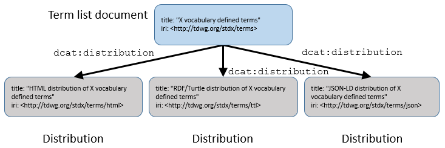

# TDWG Standards Documentation Specification

**Title:** Standards Documentation Specification

**Date Version Issued:** 2017-04-25

**Date Created:** 2007-06-06

**Part of TDWG Standard:** http://www.tdwg.org/standards/147

**This version:** http://something.tdwg.org/x/2017-04-25

**Latest version:** http://something.tdwg.org/x

**Previous version:** [http://something.tdwg.org/x/2007-06-06](https://github.com/tdwg/vocab/blob/master/tdwg-stds-spec.pdf)

**Abstract:** This document defines how TDWG standards are to be presented.  It provides details about the hierarchical structure of standards and versioning of standards components.  It specifies how the properties of standards and their components are to be described in human-readable and machine-readable terms.

**Contributors:** Steve Baskauf (TDWG Vocabulary Maintenance Specification Task Group), Roger Hyam (TDWG Infrastructure Project), Stanley Blum (TDWG Process Interest Group), Robert A. Morris (UMASS-Boston, TDWG Imaging Interest Group), Jonathan Rees (Duke University), Joel Sachs (TDWG RDF Task Group), Greg Whitbread (TDWG Technical Architecture Group), John Wieczorek (TDWG Darwin Core Task Group). Review editor: Dag Endresen (GBIF Norway/NHM University of Oslo)

**Creator:** TDWG Vocabulary Maintenance Specification Task Group

**Bibliographic citation:** Vocabulary Maintenance Specification Task Group. 2017. Standards Documentation Specification. Biodiversity Information Standards (TDWG) http://www.tdwg.org/standards/147 (put link here to provide access to standardized machine-readable citation export format)

### Table of Contents ###

```
1.1 Audience
1.2 RFC 2119 key words
1.3 Content
1.4 Examples in this document
1.5 Definitions
1.6 Namespaces used in this document

2 The structure of TDWG standards
2.1 Abstract resources and representations
2.1.1 IRIs
2.1.2 Content negotiation
2.2 Standards components hierarchy
2.2.1 Standards landing page
2.2.2 Descriptive documents
2.2.3 Vocabulary documents
2.2.4 Distributions
2.3 Versioning model
2.3.1 Current resources
2.3.2 Versions

3 Human-readable documents
3.1 Landing page for the standard
3.1.1 Name of the standard
3.1.2 IRI of the standard
3.1.3 Publisher and link to TDWG
3.1.4 Abstract
3.1.5 Status of the standard
3.1.6 Preferred citation
3.1.7 Links to parts of the standard
3.2 Descriptive documents
3.2.1 Normative and non-normative sections of descriptive documents
3.2.2 Versioning
3.2.3 Layout and style
3.2.3.1 Header Section
3.2.3.2 Table of Contents Section
3.2.3.3 Body Section
3.2.3.4 Footer section
3.2.4 Language
3.2.5 Use of RFC 2119 key words
3.3 Vocabulary descriptions
3.3.1 Landing page for the vocabulary
3.3.2 Terms as versioned resources
3.3.3 Term list documents
3.3.3.1 Term list metadata
3.3.3.2 Term list distributions
3.3.3.2.1 Example distributions record (non-normative)
3.3.4 Term version lists

4 Machine-readable documents
4.1 Identifying a resource and the machine-readable document that describes it
4.1.1 Example of linking a resource to the machine-readable document that describes it (non-normative)
4.1.2 Types of resources
4.2 General metadata
4.2.1 Metadata for standards
4.2.2 Metadata for documents and vocabularies
4.2.3 Example of expressing general metadata (non-normative)
4.2.4 Deprecating resources
4.2.4.1 Example of deprecation of a resource (non-normative)
4.3 Metadata describing and linking versions
4.3.1 Example of linking a current resource to its versions (non-normative)
4.4 Vocabularies, term lists, and terms
4.4.1 Relationships between vocabularies and term lists
4.4.1.1 Example of relationships between vocabularies and term lists (non-normative)
4.4.2 Metadata terms describing term lists
4.4.2.1 Normative and non-normative content in machine-readable representations of term lists
4.4.2.2 Vocabulary extension term lists
4.4.2.3 Examples (non-normative)
4.4.3 Linking to and describing distributions
4.4.3.1 Example (non-normative)
4.5 Metadata properties for describing vocabulary terms
4.5.1 Example metadata for terms (non-normative)
4.5.2. Labels in other languages
4.5.3 Status of terms
4.5.3.1 Example metadata showing the status of terms (non-normative)
4.5.4 Metadata properties for describing controlled vocabulary terms
4.5.4.1 Example metadata for controlled vocabulary terms (non-normative)

5 Archiving of documents
5.1 Documents from incomplete standards

6 Appendix
6.1 Extended example illustrating metadata for and relationships among a vocabulary, a term list, a term, and versions of that term
6.2 Extended example illustrating metadata for controlled vocabulary terms

7 References
```

## **1 Introduction** ##

Standards adopted by Biodiversity Information Standards (TDWG) may include a number of components that are expressed in human- and machine-readable documents. It is important that users of a standard be able to locate all of these components. Users must be able to easily determine which parts of the standard are definitive (normative) and which are informative (non-normative). It should also be apparent which components are current and which are maintained for historical reasons or to support legacy applications. Machine-readable documents should be linked and described consistently to facilitate automated discovery and processing. This standard specifies how documents SHOULD be presented to achieve these requirements.

### **1.1 Audience** ###

This document is intended primarily for those who are writing TDWG standards, including vocabularies.  It can also be useful for those who are developing applications that use TDWG vocabularies, since it defines the structure of terms and term lists in those vocabularies, and kinds of available metadata about those terms.

### **1.2 RFC 2119 key words** ###

The key words "MUST", "MUST NOT", "REQUIRED", "SHALL", "SHALL NOT", "SHOULD", "SHOULD NOT", "RECOMMENDED",  "MAY", and "OPTIONAL" in this document are to be interpreted as described in [RFC 2119](http://tools.ietf.org/html/rfc2119). [RFC-2119]

### **1.3 Content** ###

This is the only document associated with the Standards Documentation Specification.  Unless otherwise designated, all sections of it are normative.  It first describes the overall structure of a TDWG standard, then details how standards documents should be written so that they contain the necessary information to be understood by humans and by machines.

### **1.4 Examples in this document** ###

RDF examples in this document are included to clarify the normative text, although they are not themselves normative.  In some cases, IRIs represent actual standards, documents, or terms, but in many cases they are fictitious.  Additionally, in cases where the IRIs represent real resources, the properties and values shown in the examples might not represent real metadata about those resources.  The triples included in the examples do not represent a complete graph containing all of the triples necessary to comply with this standard.  Rather, they show triples that illustrate the relationships described in the sections that precede the example.  

RDF/Turtle is used in all of the examples because it is generally the easiest machine-readable serialization for humans to comprehend.  Use of Turtle does not imply that it is a preferred serialization for representing the metadata and relationships among resources in machine-readable form.  Other serializations such as RDF/XML, RDFa, and JSON-LD, or non-RDF serializations might also be used to represent the same information.  Best-practices with respect to serialization can be established by community consensus in an effort outside of this standard.

### **1.5 Definitions** ###

**content negotiation** - a mechanism by which a client and server determine the best representation to send to the client based on the client's expressed preferences [HTTP-1.1]

**controlled vocabulary** - prescribed list of terms, each representing a concept. Controlled vocabularies are designed for applications in which it is useful to identify each concept with one consistent label. Metadata properties can interact with controlled vocabularies when the value of a property is constrained to be a term from a controlled vocabulary. [ISO-25964-2]

**current resource** - a resource as it exists in its current state.  The current state reflects the most recent version of the resource.

**deprecated** - a resource is no longer valid for use.  To avoid breaking existing applications, the resource is not deleted, but rather is marked as deprecated in its metadata.  If the resource has been replaced by an alternative, the resource's metadata MUST specify the replacement.

**dereference** - to use an IRI to obtain a representation of a resource through an Internet protocol such as HTTP

**distribution** - a specific available form of a resource.  Distributions include available formats of vocabulary term lists, such as HTML, Markdown, RDF/XML or RDF/Turtle. They can also include accessible services such as an API or SPARQL endpoint.

**document** - In this context, a document is a unit of information that can be stored or retrieved electronically as a single file.

**HTTP IRI** - A subset of IRIs that enable retrieval of a representation using Hypertext Transfer Protocol (HTTP).  HTTP IRIs begin with "http://" or "https://".

**IRI** - Internationalized Resource Identifier. A superset of Uniform Resource Identifier (URI) that uniquely identifies a resource using characters from any character set. [IRI]

**metadata scheme** - a vocabulary used to make assertions about individuals (sensu OWL [OWL-OVERVIEW]). Terms (or "elements") in the scheme can represent classes or properties. Axioms can describe term properties to form an ontology. [NISO] [ISO-25964-2]

**normative content** - prescriptive parts of a standard that specify features, characteristics, or behaviors that are necessary to comply with the standard

**non-normative content** - informative parts of a standard that provide supplemental information such as history, examples, and additional explanation beyond the information necessary to comply with the standard.

**representation** - a view of a resource at a particular time. Representations can differ in language or format. [HTTP-1.1]

**resource** - Any kind of thing that can be identified. Resources can include documents, people, physical objects, and abstract concepts [RDF-PRIMER].

**term list** - An IRI-identified set of terms that is part of a vocabulary and that includes terms within the vocabulary that are grouped in a particular way, such as falling within a particular namespace.  Each term list has a corresponding document that contains the metadata for the term list and that is served when the term list IRI is dereferenced.

**user** - This standard refers to two categories of users.  A user can be a human user interacting with a server through a user-agent (software such as a Web browser), and referred to in brief as a "human".  A user can also be a machine client: computer software interacting semi-autonomously with a server, and referred to in brief as a "machine".  Both a user-agent assisting the human, and a machine client are referred to generically as "clients".

**version** - a “snapshot” of a resource in time.  A version is created at a particular moment in time and documents the state of the resource until that version is replaced by a later version.  

**vocabulary** - a collection of standardized terms and their definitions.  Terms MAY represent classes, properties, or concepts.  TDWG vocabularies can include both metadata schemes and controlled vocabularies.

**vocabulary extension term list** - a specialized type of term list that asserts additional properties for terms beyond their basic human-readable definitions.  For example, a vocabulary extension can assert for a term subclass or subproperty relations, class restrictions, ranges or domains, etc.  

### **1.6 Namespaces used in this document** ###

 In the text and examples, IRIs are frequently abbreviated using namespace abbreviations.  The abbreviations used in this document are shown in the following table.

| **Prefix**   | **Namespace**                                    |
|--------------|--------------------------------------------------|
| ac           | http://rs.tdwg.org/ac/terms/                     |
| dc           | http://purl.org/dc/elements/1.1/                 |
| dcterms      | http://purl.org/dc/terms/                        |
| dcmitype     | http://purl.org/dc/dcmitype/                     |
| dwc          | http://rs.tdwg.org/dwc/terms/                    |
| dwciri       | http://rs.tdwg.org/dwc/iri/                      |
| owl          | http://www.w3.org/2002/07/owl#                   |
| rdf          | http://www.w3.org/1999/02/22-rdf-syntax-ns#      |
| rdfs         | http://www.w3.org/2000/01/rdf-schema#            |
| sd           | http://www.w3.org/ns/sparql-service-description# |
| skos         | http://www.w3.org/2004/02/skos/core#             |
| tdwgutility  | http://rs.tdwg.org/dwc/terms/attributes/         |
| vann         | http://purl.org/vocab/vann/                      |
| xmpRights    | http://ns.adobe.com/xap/1.0/rights/              |
| xsd          | http://www.w3.org/2001/XMLSchema#                |

## **2 The structure of TDWG standards** ##

If a standard were composed of a single, human-readable document, then identifying and retrieving that document via the Internet would be relatively simple.  But TDWG standards can be composed of multiple documents that might change over time and that might be delivered in a variety of formats.  This section describes the structure of TDWG standards and the relationships among the structured components of a standard.

### **2.1 Abstract resources and representations** ###

A TDWG standard MAY be composed of several types of components.  For example, the standard can contain an explanatory document that describes how the standard should be applied in certain circumstances.  A standard can also include a vocabulary description that defines the terms included in that vocabulary.  We can consider each of these particular resources as an abstract entity that manifests itself in one or more concrete representations.  For example, a document can exist in PDF format or as an HTML web page (Fig. 1), or a document can exist as translations in several languages.  


Fig. 1. An abstract resource and its representations.

**2.1.1 IRIs**

Particular resources are assigned globally unique identifiers (GUIDs) to distinguish them from all other resources.  In standards documents, TDWG identifies resources using HTTP IRIs, a type of GUID which makes it possible to retrieve a representation of a resource using HTTP (hypertext transfer protocol).  

Both the abstract resource and specific representations of that resource are identified with HTTP IRIs.  

The IRI for abstract resources should be generic.  That is, the abstract resource IRI SHOULD NOT specify a file extension and SHOULD NOT be structured in a way that is dependent on a particular technology or query format [COOL-URIS].  In contrast, IRIs of particular resource representations MAY use an IRI structure or file extension that is useful for retrieving a particular format or translation of that resource. The IRIs of abstract resources MUST be stable, allowing them to be used in citations of the resource.

**2.1.2 Content negotiation**

A resource will normally be permanently identified by its abstract resource IRI.  When a client attempts to retrieve a representation of that resource by dereferencing its abstract IRI, it SHOULD be redirected through content negotiation to a URL that can be used to retrieve a representation of the content type or language requested by the client (Fig. 1) [GUID, Recommendation 7].  A resource MAY be available as several content types, but all resources SHOULD be retrievable in a human-readable form when media type text/html is requested.  It is also best practice to make a machine-readable representation available.  If the resource is a document that is primarily intended for human consumption, then the machine-readable representation SHOULD at a minimum contain descriptive metadata about the document. In some cases (such as vocabularies), the machine-readable representation of the resource will contain a complete description of the resource.  

### **2.2 Standards components hierarchy** ###

TDWG standards consist of several IRI-identified components.  This section describes these components and how they are related to each other.


Fig. 2. A standard and its components.

**2.2.1 Standards landing page**

Each TDWG standard will be identified by an HTTP IRI (formerly known as the "permanent URL" of the standard) that represents the standard as an abstract entity.  When the standard's IRI is dereferenced by a client requesting media type text/html (e.g. a Web browser), that IRI SHOULD redirect to a human-readable landing webpage that describes the status of the standard, contains an abstract of the standard, and hyperlinks to all components that comprise the standard.  When the standard's IRI is dereferenced by a client requesting a machine-readable format such as RDF, the client SHOULD be redirected to a document that contains machine-readable metadata about the standard.  That document SHOULD link the components of the standard to the standard using the property dcterms:isPartOf (Fig. 2) as described in Section 4.2.  Components can include descriptive documents and vocabularies.

**2.2.2 Descriptive documents**

Each TDWG standard will have at least one human-readable document that describes the purpose of the standard and that contains information about how the standard is to be used.  That document SHOULD follow the formatting guidelines of Section 3.  When the IRI of the descriptive document is dereferenced by machine clients, the client SHOULD be served a machine-readable description of the document's metadata.  

**2.2.3 Vocabulary documents**

TDWG vocabularies MUST have an HTTP IRI that represents the vocabulary itself.  The vocabulary is distinct from the standard, since the vocabulary is just one part of the standard.  For that reason, the vocabulary IRI MUST NOT be the same as the IRI that identifies the standard.  When the vocabulary IRI is dereferenced by a client requesting media type text/html, the client SHOULD obtain a web page that links to term list documents (Fig. 3).  


Fig. 3. Relationship of a vocabulary to its component term list documents.

Each term list document corresponds to one or more namespaces that include sets of terms.  Usually, there will be at least one document that lists and describes terms defined in a namespace controlled by TDWG.  The human-readable representation of that document MUST contain the normative definition of each TDWG-defined term.  The machine-readable representation of that document MUST contain the minimal machine-readable metadata described in Sections 4.2 and 4.4.2.  There MAY also be documents that list terms in namespaces outside of the standard or terms that are not defined by TDWG.  Human-readable representations of these documents SHOULD contain links to the websites that define those terms.  

Term lists MAY include terms that are defined elsewhere, but that assert additional properties for those terms that are not included in those terms' basic definitions; for example: subclass relationships, ranges, or cardinality restrictions. Such extensions can add semantic layers that are desired by some users, but that are not desired by other users who need only the basic term definitions.  Compartmentalizing vocabulary descriptions in this way enables a layered approach to vocabulary development where the development of a semantically richer vocabulary can be pursued independently of the development of "flat" vocabularies (terms and their definitions) [GBIF-KOS, Section 1.1].

**2.2.4 Distributions**

Vocabulary term lists are abstract resources, but also exist in the form of information resources that can be stored and delivered.  A human user or machine client might discover these entities through the content negotiation process (Section 2.1.2) when dereferencing the term list IRI.  However, that process is somewhat akin to trial and error, since a user would not know that the abstract resource was available in forms that were not requested.  In addition, the term list might be available for download in a form such as Markdown that is rendered as HTML when the term list URI is dereferenced requesting media type text/html, yet availability of the list in Markdown form might not be apparent to users that see the content rendered in a browser.  To enable discovery of the all forms by users or catalogers, the available forms of a resource, known as "distributions" (Fig. 4), SHOULD be made known to both humans and machines.  To accomplish that discovery, the Dublin Core term dcterms:hasFormat SHOULD be used to indicate the link from a vocabulary's term list to its available distributions.



Fig. 4. Relationship of a term list document to its distributions.

All distributions of a term list MUST contain substantively the same information about the terms on the list.  Thus a user retrieving any of the distributions MUST be able to learn the same properties and their values for all of the terms.

### **2.3 Versioning model** ###

TDWG standards and their components (Section 2.2) are resources that MAY change over time.  TDWG uses a versioning model that relates the current resource and versions of the resource that have changed over time.  The purpose of the versioning model is to enable a user to start with the current resource or any version of the resource and trace the changes that have occurred to that resource over time (Fig. 5).


Fig. 5. Relationship of a resource to its versions over time.

**2.3.1 Current resources**

Each resource (document, vocabulary, term, etc.) exists in a current state.  That current state reflects the most recent ratified version of that resource.  The current resource is identified by an IRI that does not change over time.  The current resource IRI can be used by humans or machines to retrieve a representation of the resource as it exists at the present time.  Because the current resource IRI does not change, it is stable and SHOULD be the IRI that is cited and is linked to whenever one wishes to refer to the resource in general.  

**2.3.2 Versions**

Each resource also exists as versions that document “snapshots” of the resource over time (Fig. 5).  A version is issued at a particular moment in time and documents the state of the resource until the version is replaced by a later version.  Each version of a resource is identified by an IRI that is distinct from the IRI of the current resource and from all other versions of that resource.  Typically, the IRI of a version is formed by appending the ISO 8601 creation date of the resource to the IRI of the abstract resource.  

A current resource is related to one of its versions by the property dcterms:hasVersion.  A version is related to its current resource by the property dcterms:isVersionOf, to a version that it supersedes by dcterms:replaces, and to a version that supersedes it by dcterms:isReplacedBy.  The metadata for a current resource SHOULD specify the IRI of the current resource, the IRI of the most recent version, and the IRI of any previous version that was superseded.  Metadata of a version SHOULD specify that version's IRI, specify the IRI of the current resource, and link to any previous or subsequent versions.  

The versioning model is specific to neither humans nor machines, and either should be able to use the resource IRIs and properties to traverse the links from one version to another.  


## **3 Human-readable documents** ##

In order for a standard to achieve its purpose, it will include documents that permit human users to understand what is necessary to comply with the requirements of the standard.  This section describes how human-readable documents SHOULD be constructed to make this possible.

### **3.1 Landing page for the standard** ###

When the HTTP IRI of a standard is dereferenced by a client requesting text/html (for example, when a human uses a Web browser), the client SHOULD receive a human-readable document that describes basic information about the standard as described in the subparts of this section.  

The landing page of a vocabulary standard MUST include information identifying its maintaining Interest Group and SHOULD contain a link to information explaining how changes to the vocabulary can be introduced. See Section 2.1 of the TDWG Vocabulary Maintenance Specification [MAINTENANCE] for more information about the role of Maintenance Interest Groups.

**3.1.1 Name of the standard**

The full name MUST be in English and
MUST be unique within the scope of TDWG standards, but otherwise is not
controlled and MAY contain any combination of characters.

**3.1.2 IRI of the standard**

The landing page SHOULD include the HTTP IRI that identifies the standard.  The text of the landing page SHOULD indicate that the identifying HTTP IRI is the IRI that should be cited and is the IRI to which hyperlinks SHOULD be made.  Providing this information is important because content negotiation might redirect users to some other IRI that is specific to the delivery mechanism and that might be subject to change at some time in the future.

**3.1.3 Publisher and link to TDWG**

The landing page MUST make it clear that this is a standard published by TDWG and SHOULD provide a link to the TDWG home page.  

**3.1.4 Abstract**

An abstract MUST provide a brief description of the purpose of the standard.

**3.1.5 Status of the standard**

The status MUST be one of the status categories listed at [http://www.tdwg.org/standards/status-and-categories/](http://www.tdwg.org/standards/status-and-categories/).

**3.1.6 Preferred citation**

The landing page SHOULD indicate a preferred citation for the standard that includes at least the name of the standard and the IRI. The exact format and content of the citation is not specified here.

**3.1.7 Links to parts of the standard**

Each part of the standard SHOULD be listed, with a hyperlink that leads to that part (Section 2.2).  The parts MUST include at least one descriptive document, whose form is described in Section 3.2.

### **3.2 Descriptive documents** ###

A standard has one or more descriptive documents that describe the purpose of the standard, and that contain information about how the standard is to be used. The choice of whether to place all of this material in a single document or to separate it into several documents SHOULD be made based on what will make the standard the most easy to understand and use.  

**3.2.1 Normative and non-normative sections of descriptive documents**

The normative and non-normative parts of standards MUST be clearly labeled as such.  If all of the content of a document is normative, this MUST be stated in the introduction to the document.  If a single document contains both normative and non-normative content, material in a single section SHOULD be of a single type.  The introduction SHOULD state that content is normative unless otherwise noted and headings SHOULD indicate if material in that section is non-normative.

It is also permissible to indicate in the introduction that content of a particular type (e.g. examples or diagrams) is non-normative.

**3.2.2 Versioning**

Descriptive documents are resources that follow the versioning model described in Section 2.3.  Each particular document version will represent the state of the generic document from the time it was issued until the time that version was superseded by a later version.  Thus, the date issued that is stated on a particular document version will reflect the date that particular version was issued (dcterms:issued).  Date created (dcterms:created) SHOULD be reserved to indicate the date that the first version of the document was issued.

**3.2.3 Layout and style**

Descriptive documents SHOULD be divided into four main sections:

-   A header section
-   Table of contents
-   A body section
-   A footer section

**3.2.3.1 Header Section**

The header section SHOULD contain the following parts:

**Title:** The title of the document.

**Date version issued:** The date of publication of this version in ISO 8601 Date format.

**Date created:** The date of publication of the first version in ISO 8601 Date format.

**Part of TDWG Standard:** The IRI of the standard of which this document is part. The IRI SHOULD dereference to the standard's landing page.

**This version:** The IRI of the specific version of the document that is being displayed.

**Latest version:** The current resource IRI that will always return the latest version of the document.

**Previous version:** The IRI of the previous version (if any).

**Replaced by:** The IRI of the next version (if any).

**Abstract:** A single paragraph summary of the document.

**Contributors:** A list of the people who are responsible for the
document's creation. The first person in the list SHOULD be the
principal contact.

Contributors’ names SHOULD be listed in full in the form that they typically use professionally.

A contributor's name MAY be followed by his or her affiliation in parentheses. Affiliation is the organization or group the contributor is working with in relation to the document.

**Creator:** The Task Group that created the document.

**Bibliographic citation:** The preferred citation in human-readable form. This part SHOULD also provide access to one or more standardized machine-readable citation export formats.

If the document is no longer recommended for use (i.e. deprecated), this SHOULD be noted in a **Status note** with a description of the reason and links to recommended alternatives.  This deprecation is distinct from replacement by a newer version of the same document, which SHOULD be indicated in the "Replaced by" field.  This applies to documents that are vocabulary descriptions (section 3.3), although usually particular vocabulary terms are deprecated rather than the entire vocabulary.  

**3.2.3.2 Table of Contents Section**

The table of contents section SHOULD contain an ordered list of all the headings (along with their numbers) that occur in the body section.

**3.2.3.3 Body Section**

The body text SHOULD be divided by a hierarchy of subheadings. The subheadings SHOULD be numbered consecutively using simple decimal system. The final number SHOULD NOT be followed by a decimal point. An example:

1 First Main Section

1.1 First subsection within first main section.

1.12.5 The fifth sub-subsection within the twelfth subsection of the first section.

2 Second Main Section

The first section of the body SHOULD be an introduction.  At a minimum, the introduction SHOULD explain the purpose of the document.  In the case of a standards landing page, the introduction SHOULD describe the general purpose of the entire standard.  The introductory section MAY include subsections as the authors deem necessary to introduce other information relevant to the entire document.

**3.2.3.4 Footer section**

The footer SHOULD contain a copyright statement and licensing information.  Typically, the copyright is held by Biodiversity Information Standards (TDWG). The copyright statement and licensing terms SHOULD be specified according to current TDWG policy for that type of document.  

**3.2.4 Language**

Standards documents MUST be written in English. Translations of standards documents are encouraged, but to simplify management of the standard they will be treated as ancillary documents that are not included in the standard.

**3.2.5 Use of RFC 2119 key words**

Writers of standards documents MAY choose to follow the guidelines of RFC 2119 [RFC-2119].  However, if key words are used as in RFC 2119, the introduction of the standard MUST include the recommended explanatory phrase from the RFC 2119 abstract.  (For example, see Section 1.2 of this specification.)  If the authors do not choose to implement RFC 2119 key words, they MUST NOT use all-caps formatting for the words that correspond to RFC 2119 key words.  If a standard does not implement RFC 2119 (as indicated by a lack of the recommended phrase in the introduction of the standard), users of the standard MUST NOT infer that words that correspond to the RFC 2119 have a specialized meaning beyond the common usage of those words.

The decision of whether to implement RFC 2119 key words should be informed by the implications of failure of users to conform to the requirements indicated by the key words.  The guidance provided in Sections 6 and 7 of RFC 2119 should be considered in making this decision.

### **3.3 Vocabulary descriptions** ###

Documents that describe vocabularies make up a special category of human-readable descriptive documents.  As such, vocabulary descriptions will comply with the requirements of Section 3.2.  However, they will also have additional characteristics as described in the following sections.

**3.3.1 Landing page for the vocabulary**

Although a standard might define a vocabulary, the standard MAY also include other documents such as guides that describe how the vocabulary can be used in different contexts.  It is also possible for a standard to define several vocabularies that might share subsets of terms defined by the standard.  Thus it is clear that a vocabulary is an entity that is distinct from the standard that defines it.  As such, the vocabulary will have an IRI that is distinct from the standard's IRI.  The vocabulary's landing page is the page that is presented to a human user when the vocabulary IRI is dereferenced and media type text/html is requested.

In its header, the landing page will contain the metadata described in Section 3.2.3.1, with the most recent release date serving as the Date Version Issued, and the vocabulary IRI serving as the Latest Version IRI.

As with other descriptive documents, the body of the landing page SHOULD contain an explanation of the purpose of the vocabulary.  However, it SHOULD also contain links to the term lists that indicate the terms that make up the vocabulary (Section 3.3.3).  

**3.3.2 Terms as versioned resources**

A term is a resource that persists over time (Fig. 5) and that complies with Section 2.3 of this standard. The current state of the term is represented by the term IRI, which does not change and which can be dereferenced to discover the current term definition.  

The state of the term at particular times is recorded via versions of the term.  A new version of the term is issued on a particular date and the term version IRI SHOULD be dereferenceable to discover the definition of the term version when it was issued.  

**3.3.3 Term list documents**

A human-readable term list document contains a series of term entries that can be easily read and understood by humans.  Usually, each vocabulary will have at least one term list that contains terms that are defined by the standard that contains it.  Vocabularies MAY also have term lists that contain terms that are borrowed from other vocabularies that define those terms.  For lists of terms that are defined by the standard, the term list will be identified by an IRI that corresponds to the namespace used with the listed terms, and that IRI will dereference to the term list document that describes the terms from that namespace.  For lists of terms borrowed from other vocabularies, any IRI MAY be used.  Although the lists of borrowed terms will be identified by a different IRI, it is permissible for the borrowed terms to be included in the same human-readable term list document as the terms defined by the standard.  In that case, the borrowed term list IRI SHOULD be designed so that it will dereference to the page on which the borrowed terms are listed (e.g. through use of a hash appended to the namespace IRI).

Term lists MAY also be vocabulary extensions.  A vocabulary extension describes additional properties of a term that are not included in the basic human-readable definition.  A vocabulary extension MUST be identified by a different IRI from the basic term list.  Because the mechanism of importing machine-readable representations of vocabulary extension term lists requires that those lists be included in separate documents, achieving content negotiation for both human- and machine-readable representations is simplest if the human-readable representations are also in separate documents from other human-readable term list documents that form parts of vocabulary standards.  

**3.3.3.1 Term list metadata**

Term lists containing terms defined by TDWG SHOULD include the following items in their header in addition to those RECOMMENDED for documents in general:

**Namespace URI** - the IRI that identifies the term list.

**Preferred namespace abbreviation** - the preferred abbreviation for the term list namespace.

Each term entry on the list SHOULD include the following items.

**Term name** (REQUIRED) - The term name is a controlled value that represents the class, property, or concept described by the term definition.  The term name is composed of the local name part of the term IRI, with a prepended namespace abbreviation (QName) that is defined in the header section of the vocabulary list document [RECIPES]. The term name is often related to the meaning of the term, but users MUST NOT attempt to understand the meaning of the term by interpreting its name.  Rather, the term definition MUST be consulted.

**Label** (RECOMMENDED) - The label is a word or short phrase that serves as a human-readable name for the term.

**Controlled value** (REQUIRED for controlled vocabularies, not applicable to metadata schemes) - A string that is unique within a controlled vocabulary that identifies the concept in the context of a text-based metadata transfer system.  The value MUST consist of Unicode characters.

**Term IRI** (REQUIRED) - The HTTP IRI that uniquely identifies the current term

**Term version IRI** (REQUIRED if defined by the containing vocabulary) - The HTTP IRI that identifies the version of the term that is currently in force.

**Modified** (RECOMMENDED if defined by the containing vocabulary) - The date in ISO 8601 Date format on which the most recent version of the term was issued.

**Decision** (RECOMMENDED if the term was created or modified as the result of an Executive Committee decision) - The HTTP IRI representing the record of the decision affecting the term.

**Definition** (REQUIRED) - The normative definition of the term, written in English.  The definition MUST include precisely the wording necessary to describe the class, property, or concept.  Additional informative content SHOULD be presented in comments or notes.

**Type** (REQUIRED) - Values include "Class", "Property", and "Concept".

The term list MAY contain other properties of the term that are deemed to be useful, including informative comments or notes that provide examples or clarification.

**3.3.3.2 Term list distributions**

The term list document SHOULD contain a section listing the available distributions for the term list.  Each item on the list SHOULD contain a description of the form of the distribution, the IRI of the distribution, and the download or access URL for the distribution.  If the distribution is a file, the format SHOULD be described.  If the distribution is an endpoint, the type of endpoint (for example, SPARQL or an API delivering JSON) SHOULD be described. If the distribution is viewable in a human-friendly web page, the distribution IRI MAY be hyperlinked to that page.  The download or access URL SHOULD be listed and hyperlinked to the raw file or access URL for the endpoint.  A client should be able to retrieve the raw file in the described format directly from the download URL.  A client should be able to make calls directly to the access URL of the endpoint.

**3.3.3.2.1 Example distributions record (non-normative)**

Distributions for the term list of core terms that are defined in the Darwin Core dwc: namespace

| Description | IRI | Download URL |
|-------------|-----|--------------|
| HTML file   | [http://rs.tdwg.org/dwc/terms/index.htm](https://github.com/tdwg/dwc/blob/master/terms/index.htm) | https://raw.githubusercontent.com/tdwg/dwc/master/terms/index.htm |
| RDF/XML file | [http://tdwg.github.io/dwc/rdf/dwcterms.rdf](https://github.com/tdwg/dwc/blob/master/rdf/dwcterms.rdf) | https://raw.githubusercontent.com/tdwg/dwc/master/rdf/dwcterms.rdf |

**3.3.4 Term version lists**

A term version list provides a historical record of all versions of terms that are defined as part of a standard.  It is similar to the term list described in Section 3.3.3, except that the entries on the list are versions of terms rather than current terms.  

The term version list SHOULD be identified by an IRI that facilitates discovery of the term versions that it lists when the term version IRIs are dereferenced.  

Each term version entry SHOULD include the following items.

**Term name** - The term name will be the same as the name used for the current term when the version was recommended.  Because there might be several versions of the term on the list, the term name will not necessarily be unique on the list.  

**Term version IRI** - The HTTP IRI that identifies the particular version of the term.

**Version of** - The HTTP IRI that uniquely identifies the current term associated with the version.

**Issued** - The date in ISO 8601 Date format on which the version was issued.

**Definition** - The normative definition of the term as it stood in that version.

**Replaces** - The IRI of the previous version (if any) that the subject version replaces.  

**Is replaced by** - The IRI of the subsequent version (if any) that replaces the subject version.

The term list MAY contain other properties of the term that are deemed to be useful.

## **4 Machine-readable documents** ##

It is desirable for machine clients to be able to discover and process metadata associated with standards documents and vocabularies without human intervention. This section describes how to construct machine-readable documents to make this possible.

The relationships described in this section MAY be expressed as Resource Description Framework (RDF), but that is not to the exclusion of other methods that might be available for expressing the same relationships in a manner that also facilitates machine processing.

In the same way that immutability of human-readable documents is important for the stability of a standard, the content of machine-readable documents SHOULD also be immutable. Thus, the set of machine-readable relationships (a graph in RDF) SHOULD be unchanged within a version of a document or vocabulary. Regardless of the serialization in which the machine-readable metadata are provided, that serialization MUST parse to the same set of relationships (i.e. the same RDF graph).

### **4.1 Identifying a resource and the machine-readable document that describes it** ###

In the description of any resource, it is important to distinguish between the identifier for the resource and the identifier for the machine-readable document that describes it.  When describing a resource, the resource IRI MUST be the subject of statements about the current resource.  The machine-readable document that describes it MUST have a different IRI.  The resource SHOULD be linked to the document that describes it by the property dcterms:isReferencedBy, while the machine-readable document SHOULD be linked to the resource it describes by the property dcterms:references.  In the case of vocabulary term lists, the machine-readable document that describes the list MAY be one of the term list distributions.

When a client dereferences the resource IRI, it is desirable that content negotiation result in return of a machine-readable document that describes the resource in the format requested in the request header.

**4.1.1 Example of linking a resource to the machine-readable document that describes it (non-normative)**

The following example is expressed in RDF/Turtle:

```
# This IRI identifies the text guide as an abstract resource
<http://rs.tdwg.org/dwc/terms/guides/text>
     dcterms:title "Darwin Core Text Guide";
     dcterms:isReferencedBy <https://github.com/tdwg/dwc/blob/master/terms/guides/text/index.ttl>.

# This IRI identifies the particular RDF Turtle document that describes the text guide
<https://github.com/tdwg/dwc/blob/master/terms/guides/text/index.ttl>
     dcterms:references <http://rs.tdwg.org/dwc/terms/guides/text>;
     dc:format "text/turtle".
```

When the resource IRI http://rs.tdwg.org/dwc/terms/guides/text is dereferenced requesting media type text/turtle, the server should redirect to the document https://github.com/tdwg/dwc/blob/master/terms/guides/text/index.ttl which contains the RDF description of the Darwin Core Text Guide in Turtle serialization.

**4.1.2 Types of resources**

Indicate the class of which a resource is an instance by using rdf:type [GUID, Recommendation 11].  The following classes SHOULD be used:

|**Class**                          | **Machine-readable value**|
|-----------------------------------|---------------------------|
| Standard                          | dcterms:Standard          |
| Vocabulary                        | tdwgutility:Vocabulary    |
| Term List                         | tdwgutility:TermList      |
| Vocabulary Extension List         | owl:Ontology              |
| Property                          | rdf:Property              |
| Class                             | rdfs:Class                |
| Term from a controlled vocabulary | skos:Concept              |         

Distributions and Documents SHOULD be typed according to a well-known vocabulary.  

### **4.2 General metadata** ###

The same metadata that is presented in the header section of the human-readable representations of descriptive documents and vocabulary landing pages (Section 3.2.3.1) SHOULD be provided in corresponding machine-readable documents.  

In accordance with the distinction made in the Dublin Core FAQ on DC and DCTERMS Namespaces [NAMESPACES] and following the precedent of Sections 1.4 and 3.3 of the Darwin Core RDF Guide [DWC-RDF], when a Dublin Core term has analogs in both the dc: (http://purl.org/dc/elements/1.1/) and dcterms: (http://purl.org/dc/terms/) namespaces, the dc: analog should be used with literal values (i.e. name strings), while the dcterms: analog should be used with an IRI or blank node denoting the object resource.  When an IRI is available to denote an object resource, it is desirable include the dcterms: analog in the metadata describing a resource.

**4.2.1 Metadata for standards**

The following properties with appropriate values SHOULD be used to describe a standard:

|**Human-readable label** | **Machine-readable property** | **Type of value** |
|-------------------------|-------------------------------|-------------------|
| Title                   | dcterms:title, rdfs:label *   | literal           |
| Publisher               | dc:publisher             | literal consisting of "Biodiversity Information Standards (TDWG)"|

\* Both of these terms are well-known properties used to indicate a human-readable label for a resource.  Including both increases the likelihood that a consuming application will be able to present that label to human users.  

A description of the standard MAY be provided as a value of the property dcterms:description.

**4.2.2 Metadata for documents and vocabularies**

The following properties with appropriate values SHOULD be used to describe a document or vocabulary:

|**Human-readable label** | **Machine-readable property** | **Type of value** |
|-------------------------|-------------------------------|-------------------|
| Title                   | dcterms:title, rdfs:label     | literal           |
| Part of TDWG Standard   | dcterms:isPartOf              | IRI that denotes the containing standard|
| Contributors            | dc:contributor                | literal; repeat property for each contributor's name |
| Creator                 | dc:creator                    | literal providing the name of the Task Group responsible for creating the document |
| License                 | dcterms:license               | IRI for a license; use a license type in accordance with current TDWG policy |
| Abstract                | dcterms:description           | literal containing the human-readable abstract of the document minus any references or hyperlinks |
| Bibliographic Citation  | dcterms:bibliographicCitation | literal           |

The property dcterms:contributor SHOULD be used to link the document or vocabulary to an IRI that denotes the contributor. If a well-known IRI for the contributor is not available, dcterms:contributor MAY be used to link to a blank node that contains parsed components of the contributor's name.

**4.2.3 Example of expressing general metadata (non-normative)**

```
<http://www.tdwg.org/standards/450>
     dcterms:hasPart <http://rs.tdwg.org/dwc/terms/guides/text>;
     dcterms:title "Darwin Core Standard"@en;
     rdfs:label "Darwin Core Standard"@en;
     a dcterms:Standard;
     dc:publisher "Biodiversity Information Standards (TDWG)".

<http://rs.tdwg.org/dwc/terms/guides/text>
     dcterms:title "Darwin Core Text Guide"@en;
     rdfs:label "Darwin Core Text Guide"@en;
     dcterms:isPartOf <http://www.tdwg.org/standards/450>;
     dc:contributor "Tim Robertson (GBIF)",
                    "John Wieczorek (MVZ)",
                    "Markus Döring (GBIF)",
                    "Renato de Giovanni (CRIA)",
                    "Dave Vieglais (KUNHM)";
     dcterms:contributor <http://orcid.org/0000-0001-6215-3617>,
                         <http://orcid.org/0000-0003-1144-0290>,
                         <http://orcid.org/0000-0001-7757-1889>,
                         [foaf:familyName "de Giovanni"; foaf:givenName "Renato"],
                         <http://orcid.org/0000-0002-6513-4996>;
     dc:creator "TDWG Darwin Core Task Group";
     dcterms:license <http://creativecommons.org/licenses/by/4.0/>;
     dcterms:description "Guidelines for implementing Darwin Core in Text files.";
     dcterms:bibliographicCitation "Darwin Core Task Group. 2009. Darwin Core Text Guide. , Biodiversity Information Standards (TDWG). http://rs.tdwg.org/dwc/terms/guides/text/ (accessed on [date]).".
```

**4.2.4 Deprecating resources**

Deprecation of a resource is an indication that the resource is invalid or no longer recommended for use.  This is different from the situation where a resource is replaced by a newer version that is a modification of a previous version (Section 4.3).  In all cases, deprecation of a resource is indicated by assigning the property owl:deprecated with a value of "true" datatyped as xsd:boolean.  An rdfs:comment property SHOULD provide a human-readable description of the circumstances of the deprecation.  If another resource provides additional information or a possible replacement, a link SHOULD be made from the deprecated resource to the other resource using rdfs:seeAlso.

When a resource is deprecated, that action represents a modification of that resource. Therefore, the value of dcterms:modified SHOULD be set to the date on which the decision to deprecate was made.  After the resource is deprecated, there should be no additional modifications to the resource.  So the dcterms:modified value of a deprecated resource represents the ending date of that resource's lifespan.

At the standard level, deprecation occurs when a standard is assigned to the [Retired Standard](http://www.tdwg.org/standards/status-and-categories/) category.

For information about deprecation of terms within vocabularies, see Section 4.5.3.  

**4.2.4.1 Example of deprecation of a resource (non-normative)**

```
<http://rs.tdwg.org/ontology/Core>
     dcterms:title "TDWG Ontology - Core";
     owl:deprecated "true"^^xsd:boolean;
     rdfs:comment "This ontology is no longer under development and is no longer recommended for use.  See https://github.com/tdwg/ontology for information about recommended replacements.";
     rdfs:seeAlso <https://raw.githubusercontent.com/tdwg/ontology/master/replacements.rdf>.
```

### **4.3 Metadata describing and linking versions** ###

The property owl:versionInfo, which is expected to have a literal value, SHOULD be used to provide information about the version of a resource [GUID, Recommendation 13].  This standard does not specify a particular version identifying system; however, it should be understood that version information is intended for a human audience.  Therefore, a system SHOULD be used that makes it apparent to a human that a certain version precedes or follows another version.

A current resource is related to its versions by dcterms:hasVersion, [GUID, Recommendation 13] while a version is related to its current resource by dcterms:isVersionOf.  A version is related to a previous version by dcterms:replaces, while a version is related to a subsequent version by dcterms:isReplacedBy  [GUID, Recommendation 13].

The property dcterms:issued SHOULD be used to indicate the date on which a version was published.  The property dcterms:created SHOULD be used to indicate the date that the first version of a resource was issued.  The property dcterms:modified SHOULD be used to indicate the date that the most recent version was issued.

**4.3.1 Example of linking a current resource to its versions (non-normative)**

The following example is expressed in RDF/Turtle:

```
<http://rs.tdwg.org/dwc/terms/guides/text>
     dcterms:title "Darwin Core Text Guide"@en;
     rdfs:label "Darwin Core Text Guide"@en;
     dcterms:created "2009-12-07"^^xsd:date;
     dcterms:modified "2014-11-08"^^xsd:date;
     dcterms:hasVersion <http://rs.tdwg.org/dwc/2014-11-08/terms/guides/text>;
     dcterms:hasVersion <http://rs.tdwg.org/dwc/2009-12-07/terms/guides/text>.

<http://rs.tdwg.org/dwc/2014-11-08/terms/guides/text>
     dcterms:title "Darwin Core Text Guide (2014-11-08 release)"@en;
     rdfs:label "Darwin Core Text Guide (2014-11-08 release)"@en;
     owl:versionInfo "2014-11-08";
     dcterms:isVersionOf <http://rs.tdwg.org/dwc/terms/guides/text>;
     dcterms:issued "2014-11-08"^^xsd:date;
     dcterms:replaces <http://rs.tdwg.org/dwc/2009-12-07/terms/guides/text>.

<http://rs.tdwg.org/dwc/2009-12-07/terms/guides/text>
     dcterms:title "Darwin Core Text Guide (2009-12-07 release)"@en;
     rdfs:label "Darwin Core Text Guide (2009-12-07 release)"@en;
     owl:versionInfo "2009-12-07";
     dcterms:isVersionOf <http://rs.tdwg.org/dwc/terms/guides/text>
     dcterms:issued "2009-12-07"^^xsd:date;
     dcterms:isReplacedBy <http://rs.tdwg.org/dwc/2014-11-08/terms/guides/text>.
```

See also the example in section 4.5.3.1, which illustrates versioning of terms.

### **4.4 Vocabularies, term lists, and terms** ###

A vocabulary is a resource that might form part of a standard.  A vocabulary is described by the general metadata specified in Section 4.2.  A vocabulary also includes lists of terms that the vocabulary contains.  Term lists are also described by metadata specified in Section 4.2 as well as additional properties described in Section 4.4.2.  

Vocabularies are instances of the class tdwgutility:Vocabulary, which is defined thus:

```
tdwgutility:Vocabulary rdfs:label "Vocabulary"@en;
                       rdfs:comment "A collection of standardized terms."@en;
                       rdfs:isDefinedBy <http://rs.tdwg.org/dwc/terms/attributes/>;
                       dcterms:isPartOf <http://rs.tdwg.org/dwc/terms/attributes/>;
                       a rdfs:Class.
```

Term lists are instances of the class tdwgutility:TermList, which is defined thus:

```
tdwgutility:TermList rdfs:label "Term List"@en;
                    rdfs:comment "An IRI-identified set of terms that is part of a vocabulary and that includes terms within the vocabulary that are grouped in a particular way, such as falling within a particular namespace."@en;
                    rdfs:isDefinedBy <http://rs.tdwg.org/dwc/terms/attributes/>;
                    dcterms:isPartOf <http://rs.tdwg.org/dwc/terms/attributes/>;
                    a rdfs:Class.
```

Terms, term lists, and vocabularies have hierarchical relationships that are expressed using the property dcterms:isPartOf, such that a term is part of a term list and a term list is part of a vocabulary.

**4.4.1 Relationships between vocabularies and term lists**

Vocabularies consist of at least one term list (Section 2.2.3).  In a case where it is likely that a vocabulary will never include terms beyond those defined by that vocabulary, it might be convenient to construct IRIs for the vocabulary and term list that will dereference to the same document.  For example, the vocabulary IRI might be http://rs.tdwg.org/ex, with the term list IRI http://rs.tdwg.org/ex/, or the vocabulary IRI might be http://rs.tdwg.org/ex/#vocab, with the term list IRI http://rs.tdwg.org/ex/.  With suitable server settings, these pairs of IRIs could dereference to the same representation.  This approach is NOT RECOMMENDED when a vocabulary consists of, or is likely in the future to consist of terms from multiple namespaces.  In every case, in the interest of consistency with the hierarchy model, the term list IRI and the vocabulary IRI MUST be distinct and linked by dcterms:isPartOf.

**4.4.1.1 Example of relationships between vocabularies and term lists (non-normative)**

The following example is expressed in RDF/Turtle:

```
<http://rs.tdwg.org/dwc/basic>
     dcterms:title "Darwin Core Basic Vocabulary"@en;
     rdfs:label "Darwin Core Basic Vocabulary"@en;
     dcterms:isPartOf <http://www.tdwg.org/standards/450/>;
     a tdwgutility:Vocabulary.

<http://rs.tdwg.org/dwc/enhanced-vocabulary>
     dcterms:title "Darwin Core Semantically Enhanced Vocabulary"@en;
     rdfs:label "Darwin Core Semantically Enhanced Vocabulary"@en;
     dcterms:isPartOf <http://www.tdwg.org/standards/450/>;
     a tdwgutility:Vocabulary, owl:Ontology.

<http://rs.tdwg.org/dwc/terms/>
     dcterms:title "Core terms defined by Darwin Core"@en;
     rdfs:label "Core terms defined by Darwin Core"@en;
     dcterms:isPartOf <http://rs.tdwg.org/dwc/basic>;
     dcterms:isPartOf <http://rs.tdwg.org/dwc/enhanced-vocabulary>;
     dcterms:modified "2014-11-08"^^xsd:date;
     a tdwgutility:TermList.

<http://rs.tdwg.org/dwc/dwcattributes/>
     dcterms:title "Utility terms defined by Biodiversity Information Standards (TDWG)"@en;
     rdfs:label "Utility terms defined by Biodiversity Information Standards (TDWG)"@en;
     dcterms:isPartOf <http://rs.tdwg.org/dwc/basic>;
     dcterms:isPartOf <http://rs.tdwg.org/dwc/enhanced-vocabulary>;
     dcterms:modified "2009-12-07"^^xsd:date;
     a tdwgutility:TermList.

<http://rs.tdwg.org/dwc/dcmi-terms/>
     dcterms:title "Dublin Core terms borrowed by Darwin Core"@en;
     rdfs:label "Dublin Core terms borrowed by Darwin Core"@en;
     dcterms:isPartOf <http://rs.tdwg.org/dwc/basic>;
     dcterms:isPartOf <http://rs.tdwg.org/dwc/enhanced-vocabulary>;
     dcterms:modified "2009-12-07"^^xsd:date;
     a tdwgutility:TermList.

<http://rs.tdwg.org/dwc/semantics/>
     dcterms:title "Darwin Core Semantic Relationships"@en;
     rdfs:label "Darwin Core Semantic Relationships"@en;
     dcterms:isPartOf <http://rs.tdwg.org/dwc/enhanced-vocabulary>;
     dcterms:modified "2015-03-19"^^xsd:date;
     a tdwgutility:TermList, owl:Ontology.
```

**4.4.2 Metadata terms describing term lists**

Each set of terms defined by a TDWG standard and that share a namespace will be included in a term list that corresponds to that namespace.  Thus, when the IRI of a term that is defined by the standard is dereferenced with a request for machine-readable metadata, a document MAY be returned through content negotiation that contains the metadata for those terms.  Other terms that are borrowed from other vocabularies will be grouped in one or more additional term lists.  

All terms are related to the term list that contains them by the property dcterms:isPartOf.    

Each term list containing terms defined by a particular standard will be the defining authority for those terms.  The special relationship between a term and the term list that defines it is indicated by rdfs:isDefinedBy.  Authoritative term lists SHOULD provide guidance to user about how namespaces should be abbreviated by using the following terms:

| **Human-readable label**    | **Machine-readable literal-value property**|
|-----------------------------|--------------------------------------------|
| Preferred namespace prefix  | vann:preferredNamespacePrefix              |
| Namespace IRI               | vann:preferredNamespaceUri                 |

When a preferred namespace prefix is suggested as a value for vann:preferredNamespacePrefix, it is desirable to ensure that there is no collision with other commonly used prefix abbreviations. Commonly used namepace abbreviations have been cataloged at prefix.cc  [PREFIX.CC].

Term lists for borrowed terms are simply used to group those terms and are not authoritative.  So information about preferred namespace abbreviations and IRIs will not be included in the metadata about that term list.  However, if the defining authority for terms within a namespace fails to provide that information, it can be asserted within the document that contains the metadata about the term list.  

**4.4.2.1 Normative and non-normative content in machine-readable representations of term lists**

Although term lists are described by descriptive documents, term list documents differ from generic descriptive documents in an important way.  The machine-readable representation of a descriptive document that is primarily human-readable will contain metadata about the document, but will not generally include most of the content of the document.  However, the machine-readable representation of a term list will contain substantively the same information as the human-readable document.  For that reason, it is important that any notations explaining the categories of term data that are normative SHOULD be preserved in the machine-readable data as well.  Such notations SHOULD be included as the value of an rdfs:comment property of the term list. For example, if the human-readable representation of the term list notes that term definitions are normative, but that comments are not, that note SHOULD be included as an rdfs:comment.  

**4.4.2.2 Vocabulary extension term lists**

If a vocabulary is extended by asserting properties of terms that generate machine-computable entailments (that is, axioms), those properties SHOULD be asserted in a machine-readable document that is separate from the machine-readable document that asserts the basic properties described in Section 4.5.  This separate document is a specialized kind of term list document known as a vocabulary extension term list.   The axioms contained in the extension list can be combined with the metadata about terms contained in a basic term definition list to create a semantically enhanced ontology through a layered approach [GBIF-KOS, Section 1.1].  The annotation owl:imports is used by an ontology vocabulary to gain access to the entities and axioms contained in the basic and extension term lists [OWL-SYNTAX].  

The rdf:type of a vocabulary extension list is owl:Ontology. This is entailed by the range of owl:imports; nevertheless, it is desirable to assert this explicitly.  The type of a basic term definition list SHOULD NOT be declared explicitly to be owl:Ontology, since this implies a level of semantics that might not concern all users of the basic term list.  

**4.4.2.3 Examples (non-normative)**

An example of metadata about an authoritative term list:

```
<http://rs.tdwg.org/ac/>
     dcterms:title "Basic Audubon Core Vocabulary"@en;
     rdfs:label "Basic Audubon Core Vocabulary"@en;
     a tdwgutility:Vocabulary;
     dcterms:hasPart <http://rs.tdwg.org/ac/terms/>,
                     <http://rs.tdwg.org/ac/borrowed/>.

<http://rs.tdwg.org/ac/terms/>
     dcterms:title "Audubon Core Term List"@en;
     rdfs:label "Audubon Core Term List"@en;
     vann:preferredNamespacePrefix "ac";
     vann:preferredNamespaceUri "http://rs.tdwg.org/ac/terms/";
     dcterms:isPartOf <http://rs.tdwg.org/ac/>;
     a tdwgutility:TermList.
<http://rs.tdwg.org/ac/terms/metadataLanguage>
     rdfs:label "Metadata Language";
     rdfs:isDefinedBy <http://rs.tdwg.org/ac/terms/>;
     dcterms:isPartOf <http://rs.tdwg.org/ac/terms/>;
     a rdf:Property.
<http://rs.tdwg.org/ac/terms/caption>
     rdfs:label "Caption";
     rdfs:isDefinedBy <http://rs.tdwg.org/ac/terms/>;
     dcterms:isPartOf <http://rs.tdwg.org/ac/terms/>;
     a rdf:Property.
```

An example of metadata about a non-authoritative term list:

```
<http://rs.tdwg.org/ac/borrowed/>
     dcterms:title "Audubon Core Borrowed Terms"@en;
     rdfs:label "Audubon Core Borrowed Terms"@en;
     dcterms:isPartOf <http://rs.tdwg.org/ac/>;
     a tdwgutility:TermList.
<http://iptc.org/std/Iptc4xmpExt/2008-02-29/WorldRegion>
     rdfs:label "World Region";
     dcterms:isPartOf <http://rs.tdwg.org/ac/borrowed/>;
     a rdf:Property.
<http://purl.org/dc/terms/format>
     rdfs:label "Format";
     dcterms:isPartOf <http://rs.tdwg.org/ac/borrowed/>;
     a rdf:Property.

# IPTC terms have URIs that are not dereferenceable, so give some information about their namespace
<http://iptc.org/std/Iptc4xmpExt/2008-02-29/>
     vann:preferredNamespacePrefix "Iptc4xmpExt";
     vann:preferredNamespaceUri "http://iptc.org/std/Iptc4xmpExt/2008-02-29/".
```

An example showing how normative and non-normative term data are designated:

```
<http://rs.tdwg.org/cvterms/disposition/>
     dcterms:title "Term list for the dwc:disposition controlled vocabulary"@en;
     rdfs:label "Term list for the dwc:disposition controlled vocabulary"@en;
     rdfs:comment "For each term in this list, the controlled value (rdf:value), and definition (rdfs:comment) are normative.  Labels (rdfs:label) and comments (dcterms:description) are non-normative.";
     a tdwgutility:TermList.

<http://rs.tdwg.org/cvterms/disposition/inCollection>
     rdfs:label "In Collection"@en;
     rdfs:comment "The collection item is present in the collection."@en;
     skos:definition "The collection item is present in the collection."@en;
     rdf:value "in collection";
     dcterms:description "It is recommended that collection items that are on temporary loan continue to have a value of \"in collection\".";
     rdfs:isDefinedBy <http://rs.tdwg.org/cvterms/disposition/>;
     dcterms:isPartOf <http://rs.tdwg.org/cvterms/disposition/>;
     a skos:Concept.
```

An example showing how basic and extension term lists can be used to create several vocabularies with differing levels of semantics.  Note that the mechanism of ontology import requires that sets of axioms be contained in distinct documents [OWL-SYNTAX].

```
# Document 1:
<http://rs.tdwg.org/ac/>
     dcterms:title "Basic Audubon Core Vocabulary"@en;
     rdfs:label "Basic Audubon Core Vocabulary"@en;
     a tdwgutility:Vocabulary;
     dcterms:hasPart <http://rs.tdwg.org/ac/terms/>,
                     <http://rs.tdwg.org/ac/borrowed/>.
# Note that these metadata about the Basic Vocabulary do not entail that it or its component term lists are ontologies.

# Document 2:
<http://rs.tdwg.org/ac-enhanced/>
     dcterms:title "Semantically Enhanced Audubon Core Vocabulary"@en;
     rdfs:label "Semantically Enhanced Audubon Core Vocabulary"@en;
     a tdwgutility:Vocabulary,
       owl:Ontology;
     owl:imports <http://rs.tdwg.org/ac/terms/>,
                 <http://rs.tdwg.org/ac/borrowed/>,
                 <http://rs.tdwg.org/ac/enhanced/>;
     dcterms:hasPart <http://rs.tdwg.org/ac/terms/>,
                     <http://rs.tdwg.org/ac/borrowed/>,
                     <http://rs.tdwg.org/ac/enhanced/>.
# Note that use of owl:imports entails that the basic and borrowed term lists are ontologies, even though that is not asserted in the metadata for those term lists.

# Document 3:
<http://rs.tdwg.org/ac/enhanced/>
     dcterms:title "Audubon Core Axioms"@en;
     rdfs:label "Audubon Core Axioms"@en;
     a tdwgutility:TermList,
       owl:Ontology;
### Restriction: Metadata Language Required and Not Repeatable ###
ac:MediaResource a rdfs:Class;
                   rdfs:subClassOf
                            [ a owl:Restriction;
                              owl:cardinality "1"^^xsd:nonNegativeInteger ;
                              owl:onProperty <http://rs.tdwg.org/ac/terms/metadataLanguage> ].

### Restriction: Format Not Repeatable ###
ac:MediaResource a rdfs:Class;
                   rdfs:subClassOf
                           [ a owl:Restriction;
                             owl:maxCardinality "1"^^xsd:nonNegativeInteger ;
                             owl:onProperty <http://purl.org/dc/terms/format> ].
```

**4.4.3 Linking to and describing distributions**

Term lists are linked to their distributions using the property dcterms:hasFormat. Distributions MAY be assigned any properties that are appropriate for their types. However, at a minimum, they SHOULD have the properties dcterms:modified and ac:accessURI.  If the distribution is a file having a particular format, the value of ac:accessURI should be a URL that will directly retrieve a copy of that file.  If the distribution is a representation in the form of a queriable service, communities of practice MAY establish best practices for describing the capabilities and features available via the URL specified by ac:accessURI.  If an IANA media type exists for the format of the distribution, dc:format SHOULD be used to provide the media type as a literal. [IANA]

**4.4.3.1 Example (non-normative)**

```
<http://rs.tdwg.org/dwc/terms/>
     dcterms:title "Core terms defined by Darwin Core"@en;
     rdfs:label "Core terms defined by Darwin Core"@en;
     dcterms:modified "2014-11-08"^^xsd:date;
     dcterms:hasFormat <http://rs.tdwg.org/dwc/terms/index.htm>,
                       <http://tdwg.github.io/dwc/rdf/dwcterms.rdf>,
                       _:sparqlEndpoint;
     a tdwgutility:TermList.
<http://rs.tdwg.org/dwc/terms/index.htm>
     dcterms:title "HTML distribution of the term list of core terms defined by Darwin Core"@en;
     rdfs:label "HTML distribution of the term list of core terms defined by Darwin Core"@en;
     dcterms:modified "2016-01-12"^^xsd:date;
     dc:format "text/html";
     ac:accessURI <https://raw.githubusercontent.com/tdwg/dwc/master/terms/index.htm>;
     a foaf:Document.
<http://tdwg.github.io/dwc/rdf/dwcterms.rdf>
     dcterms:title "RDF/XML distribution of the term list of core terms defined by Darwin Core"@en;
     rdfs:label "RDF/XML distribution of the term list of core terms defined by Darwin Core"@en;
     dcterms:modified "2015-07-03"^^xsd:date;
     dc:format "application/rdf+xml";
     ac:accessURI <https://raw.githubusercontent.com/tdwg/dwc/master/rdf/dwcterms.rdf>;
     a foaf:Document.
_:sparqlEndpoint
     dcterms:title "SPARQL endpoint from which core terms defined by Darwin Core may be accessed"@en;
     rdfs:label "SPARQL endpoint from which core terms defined by Darwin Core may be accessed"@en;
     dcterms:modified "2016-01-12"^^xsd:date;
     ac:accessURI <http://rdf.library.vanderbilt.edu/sparql>;
     a sd:Service.
```

### **4.5 Metadata properties for describing vocabulary terms** ###

Because terms are resources, they are versioned and the terms used for relating current resources to versions (Section 4.3) apply to them as well.

The following properties are RECOMMENDED for current terms and term versions. Note that the term or term version IRI will be present as the subject of the property

| **Human-readable label** | **Machine-readable property** | **Type of value** |
|--------------------------|-------------------------------|-------------------|
| Term name                | rdfs:label                    | Literal           |
| Definition               | rdfs:comment                  | Literal           |
| Type                     | rdf:type                      | IRI               |

Values for rdfs:label and rdfs:comment SHOULD be English language-tagged plain literals.  Values in other languages MAY be provided, but SHOULD be included in other ancillary documents that are associated with, but not included within the standard (see Section 4.5.2).

Types SHOULD be rdf:Property for properties, rdfs:Class for classes, and skos:Concept for controlled values.

The property dcterms:description MAY optionally be used to provide additional information that is not part of the definition of the term.  

If the term was created or modified as the result of an Executive Committee decision, the property tdwgutility:decision SHOULD be used to link to the HTTP IRI representing the record of the decision affecting the term.

Properties that extend the meaning of terms by introducing machine-computable entailments SHOULD NOT be included with the basic properties listed in this section.  Rather they SHOULD be included in a vocabulary extension list as described in Section 4.4.2.2.

**4.5.1 Example metadata for terms (non-normative)**

The following example of a current term is expressed in RDF/Turtle.  In addition to the general metadata properties described in Section 4.5, the current term is also linked to its versions as described in Section 4.3 and to its defining term list as described in section 4.4.2.

```
<http://rs.tdwg.org/dwc/terms/recordedBy>
     rdfs:label "Recorded By"@en;
     rdfs:comment "A list (concatenated and separated) of names of people, groups, or organizations responsible for recording the original Occurrence. The primary collector or observer, especially one who applies a personal identifier (recordNumber), should be listed first."@en;
     dcterms:description "The recommended best practice is to separate the values with a vertical bar (' | '). The primary collector or observer, especially one who applies a personal identifier (recordNumber), should be listed first. Examples: "José E. Crespo", "Oliver P. Pearson | Anita K. Pearson" where the value in recordNumber "OPP 7101" corresponds to the number for the specimen in the field catalog (collector number) of Oliver P. Pearson."@en;
     a rdfs:Property;
     dcterms:modified "2014-10-23"^^xsd:date;
     dcterms:hasVersion <http://rs.tdwg.org/dwc/terms/history/#recordedBy-2014-10-23>;
     dcterms:hasVersion <http://rs.tdwg.org/dwc/terms/history/#recordedBy-2009-04-24>;
     rdfs:isDefinedBy <http://rs.tdwg.org/dwc/terms/>;
     dcterms:isPartOf <http://rs.tdwg.org/dwc/terms/>.
```

The following example of a term version is expressed in RDF/Turtle.  In addition to the general metadata properties described in Section 4.5, the term version is also linked to its current term and previous version as described in Section 4.3 and to its defining term list as described in section 4.4.2.


```
<http://rs.tdwg.org/dwc/terms/history/#recordedBy-2014-10-23>
     rdfs:label "Recorded By"@en;
     rdfs:comment "A list (concatenated and separated) of names of people, groups, or organizations responsible for recording the original Occurrence. The primary collector or observer, especially one who applies a personal identifier (recordNumber), should be listed first."@en;
     dcterms:description "The recommended best practice is to separate the values with a vertical bar (' | '). The primary collector or observer, especially one who applies a personal identifier (recordNumber), should be listed first. Examples: "José E. Crespo", "Oliver P. Pearson | Anita K. Pearson" where the value in recordNumber "OPP 7101" corresponds to the number for the specimen in the field catalog (collector number) of Oliver P. Pearson."@en;
     a rdfs:Property;
     dcterms:issued "2014-10-23"^^xsd:date;
     dcterms:isVersionOf <http://rs.tdwg.org/dwc/terms/recordedBy>;
     dcterms:replaces <http://rs.tdwg.org/dwc/terms/history/#recordedBy-2009-04-24>;
     rdfs:isDefinedBy <http://rs.tdwg.org/dwc/terms/history/>;
     dcterms:isPartOf <http://rs.tdwg.org/dwc/terms/history/>.
```

For a more extensive example, see Section 6.1.

**4.5.2. Labels in other languages**

In addition to following the generic practice of using rdfs:label to assign a name to the term (Section 4.5), it might also desirable to use the specific SKOS properties skos:prefLabel and skos:altLabel to indicate the preferred and alternative labels for vocabulary terms in other languages.  However, assignment of such labels falls outside the TDWG Standards process, so these preferred and alternate labels SHOULD be included in ancillary documents associated with, but not included within the standard itself.

**4.5.3 Status of terms**

Current terms that are no longer valid SHOULD have the property owl:deprecated with a literal value of "true" datatyped as xsd:boolean.  Note that in this context, a "current" term does not necessarily mean that it is recommended or valid for use.  Rather, it means that the term IRI can be dereferenced by a client that wants to obtain information about it.  If a deprecated term has been replaced by another term, the property dcterms:isReplacedBy MUST be used to link the deprecated term to its replacement, and the term dcterms:replaces MUST be used to link the replacement to the deprecated term.

Term versions SHOULD have the property tdwgutility:status with possible values of "recommended" (for the most recent term version of a term that is currently valid), "superseded" (for term versions having more recent versions), or "deprecated" (for the most recent version of a term that is no longer valid).  As is the case for all described resources, previous and subsequent versions SHOULD be linked using dcterms:replaces and dcterms:isReplacedBy. This includes cases where the replacement for a version of a deprecated current term is a version of a current term with a different URI.

**4.5.3.1 Example metadata showing the status of terms (non-normative)**

This example illustrates the case where a term is replaced by another term with a different IRI.

```
dwc:individualID
     a rdf:Property;
     dcterms:description """Examples: \"U.amer. 44\", \"Smedley\", \"Orca J 23\""""@en;
     rdfs:comment "An identifier for an individual or named group of individual organisms represented in the Occurrence. Meant to accommodate resampling of the same individual or group for monitoring purposes. May be a global unique identifier or an identifier specific to a data set."@en;
     rdfs:label "Individual ID"@en;
     dcterms:hasVersion <http://rs.tdwg.org/dwc/terms/individualID-2009-04-24>;
     dcterms:created "2009-04-24"^^xsd:date;
     dcterms:modified "2009-04-24"^^xsd:date;
     tdwgutility:decision "http://rs.tdwg.org/dwc/terms/history/decisions/#Decision-2014-10-26_14";
     owl:deprecated "true"^^xsd:boolean;
     dcterms:isReplacedBy dwc:organismID.

dwc:organismID
     a rdf:Property;
     rdfs:comment "An identifier for the Organism instance (as opposed to a particular digital record of the Organism). May be a globally unique identifier or an identifier specific to the data set."@en;
     rdfs:label "Organism ID"@en;
     dcterms:hasVersion <http://rs.tdwg.org/dwc/terms/organismID-2014-10-23>;
     dcterms:created "2014-10-23"^^xsd:date;
     dcterms:modified "2014-10-23"^^xsd:date;
     tdwgutility:decision "http://rs.tdwg.org/dwc/terms/history/decisions/#Decision-2014-10-26_14";
     dcterms:replaces dwc:individualID.

<http://rs.tdwg.org/dwc/terms/individualID-2009-04-24>
     a rdf:Property;
     dcterms:isVersionOf dwc:individualID;
     tdwgutility:status "deprecated"^^xsd:string;
     dcterms:issued "2009-04-24"^^xsd:date;
     dcterms:description """Examples: \"U.amer. 44\", \"Smedley\", \"Orca J 23\""""@en;
     rdfs:comment "An identifier for an individual or named group of individual organisms represented in the Occurrence. Meant to accommodate resampling of the same individual or group for monitoring purposes. May be a global unique identifier or an identifier specific to a data set."@en;
     dcterms:isReplacedBy <http://rs.tdwg.org/dwc/terms/organismID-2014-10-23>.
<http://rs.tdwg.org/dwc/terms/organismID-2014-10-23>
     a rdf:Property;
     dcterms:isVersionOf dwc:organismID;
     tdwgutility:status "recommended"^^xsd:string;
     dcterms:issued "2014-10-23"^^xsd:date;
     rdfs:comment "An identifier for the Organism instance (as opposed to a particular digital record of the Organism). May be a globally unique identifier or an identifier specific to the data set."@en;
     dcterms:replaces <http://rs.tdwg.org/dwc/terms/individualID-2009-04-24>.
```

This example illustrates the case where a term version is superseded by a newer version of the term.

```
dwc:MaterialSample
     a rdfs:Class;
     rdfs:comment "A physical results of a sampling (or subsampling) event. In biological collections, the material sample is typically collected, and either preserved or destructively processed."@en;
     dcterms:description "Examples: A whole organism preserved in a collection. A part of an organism isolated for some purpose. A soil sample. A marine microbial sample."@en;
     rdfs:label "Material Sample"@en;
     dcterms:hasVersion <http://rs.tdwg.org/dwc/terms/MaterialSample-2014-10-23>;
     dcterms:hasVersion <http://rs.tdwg.org/dwc/terms/MaterialSample-2013-03-28>;
     dcterms:created "2013-03-28"^^xsd:date;
     dcterms:modified "2014-10-23"^^xsd:date; # date of issue of most recent version
     tdwgutility:decision "http://rs.tdwg.org/dwc/terms/history/decisions/#Decision-2014-10-26_15".

<http://rs.tdwg.org/dwc/terms/MaterialSample-2013-03-28>
     a rdfs:Class;
     dcterms:isVersionOf dwc:MaterialSample;
     tdwgutility:status "superseded"^^xsd:string;
     dcterms:issued "2013-03-28"^^xsd:date;
     rdfs:comment "The category of information pertaining to the physical results of a sampling (or subsampling) event. In biological collections, the material sample is typically collected, and either preserved or destructively processed."@en;
     dcterms:isReplacedBy <http://rs.tdwg.org/dwc/terms/MaterialSample-2014-10-23>.
<http://rs.tdwg.org/dwc/terms/MaterialSample-2014-10-23>
     a rdfs:Class;
     dcterms:isVersionOf dwc:MaterialSample;
     tdwgutility:status "recommended"^^xsd:string;
     dcterms:issued "2014-10-23"^^xsd:date;
     rdfs:comment "A physical results of a sampling (or subsampling) event. In biological collections, the material sample is typically collected, and either preserved or destructively processed."@en;
     dcterms:description "Examples: A whole organism preserved in a collection. A part of an organism isolated for some purpose. A soil sample. A marine microbial sample."@en;
     dcterms:replaces <http://rs.tdwg.org/dwc/terms/MaterialSample-2013-03-28>.
```

**4.5.4 Metadata properties for describing controlled vocabulary terms**

Controlled vocabulary terms are instances of the class skos:Concept.  As such, it is appropriate to assign to such terms properties from the SKOS Simple Knowledge Organization System W3C Recommendation [SKOS] as necessary to define the relationships between that term and other resources.  (With the exception of skos:prefLabel and skos:altLabel, it is not generally appropriate to use SKOS vocabulary properties with terms from metadata schemes that are instances of the classes rdf:Property and rdfs:Class.)  Since it is a general practice to assign SKOS concepts to a concept scheme, controlled vocabulary terms SHOULD be linked to that scheme by skos:inScheme.  However, the structuring of such schemes is beyond the scope of this document.

To facilitate use by applications programmed to make use of SKOS properties, it is RECOMMENDED that controlled vocabulary term descriptions include a skos:definition property that has the same value as the rdfs:comment property routinely used to indicate the human-readable definition for every TDWG vocabulary term.

As with all other TDWG vocabulary terms, controlled value terms will be assigned a term IRI.  That IRI MAY be used as the subject or object when expressing relationships with other resources.  However, in the context of information transfer, there might be cases where it is more desirable to represent the controlled vocabulary term by means of a unique text string.  To facilitate such use, each controlled vocabulary term MUST be assigned a string that is unique within that controlled vocabulary.  That string SHOULD be designated by making it a plain literal value (without language tag) of an rdf:value property of the term.  

**4.5.4.1 Example metadata for controlled a vocabulary term (non-normative)**

The following example of a current controlled vocabulary term is expressed in RDF/Turtle. Note that although in this example the containing vocabulary (http://rs.tdwg.org/cvterms/disposition) is considered an skos:ConceptScheme, this specification does not dictate best practices for grouping controlled value terms into concept schemes.  

```
<http://rs.tdwg.org/cvterms/disposition/inCollection>
     rdfs:label "In Collection"@en;
     rdfs:comment "The collection item is present in the collection."@en;
     skos:definition "The collection item is present in the collection."@en;
     rdf:value "in collection";
     a skos:Concept;
     dcterms:created "2016-04-09"^^xsd:date;
     dcterms:modified "2016-04-09"^^xsd:date;
     skos:inScheme <http://rs.tdwg.org/cvterms/disposition>;
     dcterms:hasVersion <http://rs.tdwg.org/cvterms/disposition/inCollection-2016-04-09>;
     rdfs:isDefinedBy <http://rs.tdwg.org/cvterms/disposition/>;
     dcterms:isPartOf <http://rs.tdwg.org/cvterms/disposition/>.
```

See Section 6.2 for a more extensive example.

The following example illustrates the use of the controlled vocabulary term from the previous example:

```
<http://arctos.database.museum/guid/MVZ:Mamm:115956#specimen> dwc:disposition "in collection".
<http://bioimages.vanderbilt.edu/vanderbilt/3-108> dwciri:disposition dwcdisp:inCollection.
```

See section 2.5 of the Darwin Core RDF Guide [DWC-RDF] for the distinction in the use of dwc: and dwciri: namespace terms.

## **5 Archiving of documents** ##

In order for a standard to enable compliance with a consensus community practice, a version of a standards document SHOULD be immutable and easily viewable by the public. This has several implications for the way in which documents are archived.

In order to ensure the stability of a human-readable document, it SHOULD be archived as a discrete file as opposed to being generated from a potentially changing database.  The archived document file SHOULD be in an open format for which parsers are commonly available. For this purpose an open format is defined as being one for which it would be possible to write a parser on the basis of a published specification without having to rely on code libraries for which the source code is not available or to pay a license fee.

In accordance with Section 2.1, the document MAY exist as files in a variety of formats that can be retrieved through content negotiation.  For example, a document MAY be available in any of HTML, PDF, and Markdown formats.  However, when rendered by a parser, each differently formatted file SHOULD render to a form that is substantively the same to a human reader.  At least one available form SHOULD be easily viewable to a human reader in a browser that requests text/html, regardless of whether the source file is actually in HTML format.

If a human-readable document is available in more than one format, the format that is delivered when that document's IRI is dereferenced requesting media type text/html will be considered to be the authoritative representation of the document.  The document in that format MUST be included in the archive for the standard. Other formats MAY be distributed by any mechanism, but in accordance with Section 3.2.3.1, those formats SHOULD include the "Latest version" IRI so that a reader can always retrieve the authoritative form of the document.  

If machine-readable documents are available in more than one serialization, they MUST all contain triples that would be interpreted as identical by a machine.  At least one of these serializations SHOULD be included in the archive for the standard.

Documents SHOULD be maintained as part of a publicly accessible version control system that ensures document files will not be lost and that previous document versions can be located and accessed through their immutable IRIs.  

### **5.1 Documents from incomplete standards** ###

If a Task Group chartered to develop a standard fails to meet the requirement of its charter, it may be disbanded by the Executive Committee [PROCESS].  In that case, drafts of documents created by the Task Group should be published as Task Group Notes.  The Header Section of each document should include a Status Note (Section 3.2.3.1) including the following statement: "This document has been published as a Task Group Note and is no longer under development. It has not been endorsed by TDWG and has been made available for reference purposes only." Machine-readable representations of the documents (if any) should include this statement as the value of an rdfs:comment property.

## **6 Appendix**

The following examples provide more extensive illustrations of the use of metadata to describe and link components of a vocabulary.

### **6.1 Extended example illustrating metadata for and relationships among a vocabulary, a term list, a term, and versions of that term (non-normative)**

The following example of terms in a metadata scheme is an elaboration of the example in Section 4.5.1 and is expressed in RDF/Turtle.  Note that it follows the pattern where the term list URI would dereference to a different document than the vocabulary URI.

```
<http://rs.tdwg.org/dwc/>
     dcterms:title "Basic Darwin Core Vocabulary"@en;
     rdfs:label "Basic Darwin Core Vocabulary"@en;
     a tdwgutility:Vocabulary.

<http://rs.tdwg.org/dwc/terms/>
     dcterms:title "Core terms defined by Darwin Core"@en;
     rdfs:label "Core terms defined by Darwin Core"@en;
     vann:preferredNamespacePrefix "dwc";
     vann:preferredNamespaceUri "http://rs.tdwg.org/dwc/terms/";
     dcterms:isPartOf <http://rs.tdwg.org/dwc/>;
     a tdwgutility:TermList.

<http://rs.tdwg.org/dwc/terms/recordedBy>
     rdfs:label "Recorded By"@en;
     rdfs:comment "A list (concatenated and separated) of names of people, groups, or organizations responsible for recording the original Occurrence. The primary collector or observer, especially one who applies a personal identifier (recordNumber), should be listed first."@en;
     dcterms:description "The recommended best practice is to separate the values with a vertical bar (' | '). The primary collector or observer, especially one who applies a personal identifier (recordNumber), should be listed first. Examples: "José E. Crespo", "Oliver P. Pearson | Anita K. Pearson" where the value in recordNumber "OPP 7101" corresponds to the number for the specimen in the field catalog (collector number) of Oliver P. Pearson."@en;
     a rdfs:Property;
     dcterms:modified "2014-10-23"^^xsd:date;
     dcterms:hasVersion <http://rs.tdwg.org/dwc/terms/history/#recordedBy-2014-10-23>;
     dcterms:hasVersion <http://rs.tdwg.org/dwc/terms/history/#recordedBy-2009-04-24>;
     rdfs:isDefinedBy <http://rs.tdwg.org/dwc/terms/>;
     dcterms:isPartOf <http://rs.tdwg.org/dwc/terms/>.

<http://rs.tdwg.org/dwc/terms/history/>
     dcterms:title "Darwin Core Terms Complete History"@en;
     a tdwgutility:TermList.

<http://rs.tdwg.org/dwc/terms/history/#recordedBy-2014-10-23>
     rdfs:label "Recorded By"@en;
     rdfs:comment "A list (concatenated and separated) of names of people, groups, or organizations responsible for recording the original Occurrence. The primary collector or observer, especially one who applies a personal identifier (recordNumber), should be listed first."@en;
     dcterms:description "The recommended best practice is to separate the values with a vertical bar (' | '). The primary collector or observer, especially one who applies a personal identifier (recordNumber), should be listed first. Examples: "José E. Crespo", "Oliver P. Pearson | Anita K. Pearson" where the value in recordNumber "OPP 7101" corresponds to the number for the specimen in the field catalog (collector number) of Oliver P. Pearson."@en;
     a rdfs:Property;
     dcterms:issued "2014-10-23"^^xsd:date;
     dcterms:isVersionOf <http://rs.tdwg.org/dwc/terms/recordedBy>;
     dcterms:replaces <http://rs.tdwg.org/dwc/terms/history/#recordedBy-2009-04-24>;
     rdfs:isDefinedBy <http://rs.tdwg.org/dwc/terms/history/>;
     dcterms:isPartOf <http://rs.tdwg.org/dwc/terms/history/>.

<http://rs.tdwg.org/dwc/terms/history/#recordedBy-2009-04-24>
     rdfs:label "Recorded By"@en;
     rdfs:comment "A list (concatenated and separated) of names of people, groups, or organizations responsible for recording the original Occurrence. The primary collector or observer, especially one who applies a personal identifier (recordNumber), should be listed first."@en;
     dcterms:description "Example: "Oliver P. Pearson; Anita K. Pearson" where the value in recordNumber "OPP 7101" corresponds to the number for the specimen in the field catalog (collector number) of Oliver P. Pearson."@en;
     a rdfs:Property;
     dcterms:issued "2009-04-24"^^xsd:date;
     dcterms:isVersionOf <http://rs.tdwg.org/dwc/terms/recordedBy>;
     dcterms:isReplacedBy <http://rs.tdwg.org/dwc/terms/history/#recordedBy-2014-10-23>;
     rdfs:isDefinedBy <http://rs.tdwg.org/dwc/terms/history/>;
     dcterms:isPartOf <http://rs.tdwg.org/dwc/terms/history/>.
```

## **6.2 Extended example illustrating metadata for controlled vocabulary terms (non-normative)**

The following example of terms in a controlled vocabulary is an elaboration of the example in Section 4.5.4.1 and is expressed in RDF/Turtle.  Note that it follows the pattern where the term list URI dereferences to the same document as the vocabulary URI.  Also note that this example models the vocabulary as a skos:ConceptScheme.

```
<http://rs.tdwg.org/cvterms/disposition>
     dcterms:title "Controlled vocabulary for dwc:disposition"@en;
     rdfs:label "Controlled vocabulary for dwc:disposition"@en;
     a tdwgutility:Vocabulary,
       skos:ConceptScheme.

<http://rs.tdwg.org/cvterms/disposition/>
     dcterms:title "Term list for the dwc:disposition controlled vocabulary"@en;
     rdfs:label "Term list for the dwc:disposition controlled vocabulary"@en;
     vann:preferredNamespacePrefix "dwcdisp";
     vann:preferredNamespaceUri "http://rs.tdwg.org/cvterms/disposition/";
     dcterms:isPartOf <http://rs.tdwg.org/cvterms/disposition>;
     a tdwgutility:TermList.

<http://rs.tdwg.org/cvterms/disposition/inCollection>
     rdfs:label "In Collection"@en;
     rdfs:comment "The collection item is present in the collection."@en;
     skos:definition "The collection item is present in the collection."@en;
     rdf:value "in collection";
     a skos:Concept;
     dcterms:created "2016-04-09"^^xsd:date;
     dcterms:modified "2016-04-09"^^xsd:date;
     skos:inScheme <http://rs.tdwg.org/cvterms/disposition>;
     dcterms:hasVersion <http://rs.tdwg.org/cvterms/disposition/inCollection-2016-04-09>;
     rdfs:isDefinedBy <http://rs.tdwg.org/cvterms/disposition/>;
     dcterms:isPartOf <http://rs.tdwg.org/cvterms/disposition/>.

<http://rs.tdwg.org/cvterms/disposition/destroyed>
     rdfs:label "Destroyed"@en;
     rdfs:comment "The collection item is no longer in the collection because it was destroyed."@en;
     skos:definition "The collection item is no longer in the collection because it was destroyed."@en;
     rdf:value "destroyed";
     a skos:Concept;
     dcterms:created "2016-04-09"^^xsd:date;
     dcterms:modified "2016-04-09"^^xsd:date;
     skos:inScheme <http://rs.tdwg.org/cvterms/disposition>;
     dcterms:hasVersion <http://rs.tdwg.org/cvterms/disposition/destroyed-2016-04-09>;
     rdfs:isDefinedBy <http://rs.tdwg.org/cvterms/disposition/>;
     dcterms:isPartOf <http://rs.tdwg.org/cvterms/disposition/>.

<http://rs.tdwg.org/cvterms/disposition/history/>
     dcterms:title "Version history for the dwc:disposition controlled vocabulary"@en;
     rdfs:label "Version history for the dwc:disposition controlled vocabulary"@en;
     a tdwgutility:TermList.

<http://rs.tdwg.org/cvterms/disposition/inCollection-2016-04-09>
     rdfs:label "In Collection"@en;
     rdfs:comment "The collection item is present in the collection."@en;
     skos:definition "The collection item is present in the collection."@en;
     rdf:value "in collection";
     a skos:Concept;
     dcterms:issued "2016-04-09"^^xsd:date;
     dcterms:isVersionOf <http://rs.tdwg.org/cvterms/disposition/inCollection>;
     rdfs:isDefinedBy <http://rs.tdwg.org/cvterms/disposition/history/>;
     dcterms:isPartOf <http://rs.tdwg.org/cvterms/disposition/history/>.

<http://rs.tdwg.org/cvterms/disposition/destroyed-2016-04-09>
     rdfs:label "Destroyed"@en;
     rdfs:comment "The collection item is no longer in the collection because it was destroyed."@en;
     skos:definition "The collection item is no longer in the collection because it was destroyed."@en;
     rdf:value "destroyed";
     a skos:Concept;
     dcterms:issued "2016-04-09"^^xsd:date;
     dcterms:isVersionOf <http://rs.tdwg.org/cvterms/disposition/destroyed>;
     rdfs:isDefinedBy <http://rs.tdwg.org/cvterms/disposition/history/>;
     dcterms:isPartOf <http://rs.tdwg.org/cvterms/disposition/history/>.
```


## **7 References** ##

[COOL-URIS] http://www.w3.org/TR/cooluris/#cooluris Cool URIs for the Semantic Web

[DWC-RDF] http://rs.tdwg.org/dwc/terms/guides/rdf/ TDWG Darwin Core RDF Guide.

[GBIF-KOS] http://www.gbif.org/resource/80656 Recommendations for the Use of Knowledge Organisation Systems by GBIF. 04 Feb 2011. Global Biodiversity Information Facility.

[GUID] http://www.tdwg.org/standards/150 TDWG GUID Applicability Statement

[HTTP-1.1] http://tools.ietf.org/html/rfc7231 Hypertext Transfer Protocol (HTTP/1.1): Semantics and Content

[IANA] http://www.iana.org/assignments/media-types/media-types.xhtml Internet Assigned Numbers Authority (IANA) Media Types

[IRI] http://tools.ietf.org/html/rfc3987 Internationalized Resource Identifiers (IRIs). 2005. The Internet Engineering Task Force.

[ISO-25964-2] ISO 25964-2. Information and documentation: Thesauri and interoperability with other vocabularies. Part 2: Interoperability with other vocabularies. 2013-03-15.

[MAINTENANCE] http://www.tdwg.org/standards/642 TDWG Vocabulary Maintenance Specification.

[NAMESPACES] http://wiki.dublincore.org/index.php/FAQ/DC_and_DCTERMS_Namespaces FAQ/DC and DCTERMS Namespaces. Dublin Core Metadata Initiative.

[NISO] http://www.niso.org/publications/press/UnderstandingMetadata.pdf Understanding Metadata. 2004. NISO Press.

[OWL-OVERVIEW] http://www.w3.org/TR/owl-overview OWL Web Ontology Language Document Overview (W3C Recommendation). World Wide Web Consortium.

[OWL-SYNTAX] http://www.w3.org/TR/owl-syntax OWL 2 Web Ontology Language
Structural Specification and Functional-Style Syntax (W3C Recommendation). World Wide Web Consortium.

[PREFIX.CC] http://prefix.cc Namespace lookup for RDF developers

[PROCESS] http://www.tdwg.org/about-tdwg/process/ Biodiversity Information Standards. The Standards Development Process.

[RECIPES] https://www.w3.org/TR/swbp-vocab-pub/ Best Practice Recipes for Publishing RDF Vocabularies. 2008.  W3C Working Group Note.

[RDF-PRIMER] http://www.w3.org/TR/rdf11-primer/ RDF 1.1 Primer

[REST] http://roy.gbiv.com/pubs/dissertation/rest_arch_style.htm Representational State Transfer (REST) from Architectural Styles and
the Design of Network-based Software Architectures

[RFC-2119] http://tools.ietf.org/html/rfc2119 Key words for use in RFCs to Indicate Requirement Levels. 1997. The Internet Engineering Task Force.

[SKOS] https://www.w3.org/TR/skos-reference/ SKOS Simple Knowledge Organization System
Reference

-----------------
This document is licensed under a [Creative Commons Attribution 4.0 International License](http://creativecommons.org/licenses/by/4.0/). .

Copyright 2017 - Biodiversity Information Standards - TDWG - [Contact Us](http://www.tdwg.org/about-tdwg/contact-us/)
